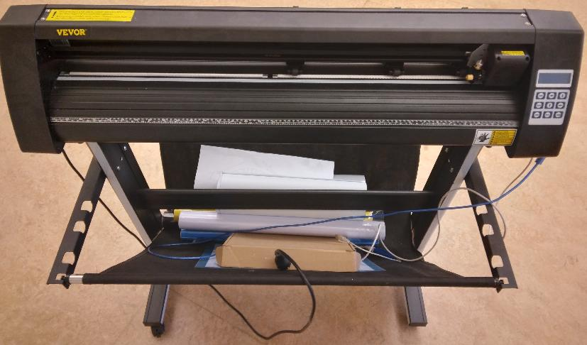
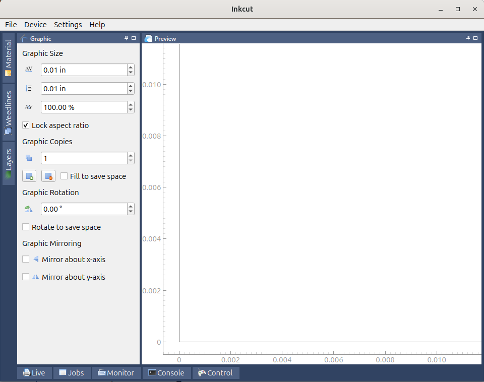
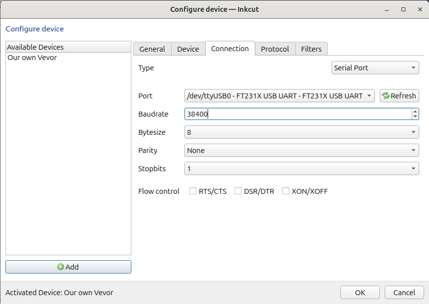
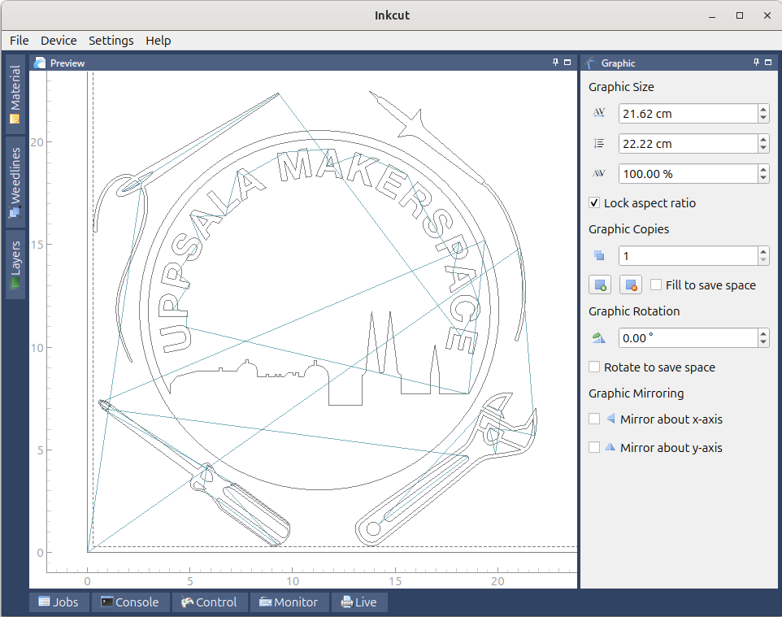

# vevor_vinyl_cutter_to_t_shirt_manual

Our Vevor vinyl cutter from the front|Our Vevor vinyl cutter from an isometric perpective
-------------------------------------|-------------------------------------
    |

Manual for using the Vevor vinyl cutter to create a T-shirt

Produre:

- 1. Instal Inkcut
- 2. Setup Inkcut
- 3. Use Inkcut
- 4. Tranfer vinyl to T-shirt

## 1. Install Inkcut

- See [Install Inkcut notes](install_inkcut_notes.md) for the notes behind this

Install the Debian packages:

```bash
apt-get install python3-pip python3-pyqt5 python3-setuptools libcups2-dev python3-pyqt5.qtsvg
```

Create a (mandatory!) virtual environment for Inkcut:

```
python3 -m venv ~/inkcut_venv
```

Install the Inkcut and PyQt5 Python packages in the virtual environment"

```
~/inkcut_venv/bin/pip install inkcut PyQt5
```

Now you can start `inkcut` with:

```
~/inkcut_venv/bin/inkcut 
```



## 2. Setup Inkcut

- See [Setup Inkcut notes](setup_inkcut_notes.md) for the notes behind this

Add yourself to the `dialout` group:

```
sudo usermod -a -G dialout "$USER"
```

Restart (yes, a cold boot!).

Plug in the correct USB cable from the vinyl cutter to your computer.

Go to the 'Configure device | Connection':

- Type: Serial port
- Port: `ttyUSB0`. If you cannot select `ttyUSB0`, you've used the wrong USB cable
  coming out of the viny cutter :-)
- Baudrate: 38400



> Use the serial port with a baudrate of 38400.
> If you cannot select `ttyUSB0`, you've used the wrong USB cable
> coming out of the viny cutter

## 3. Use Inkcut



> Inkcut in action

## 4. Tranfer vinyl to T-shirt
