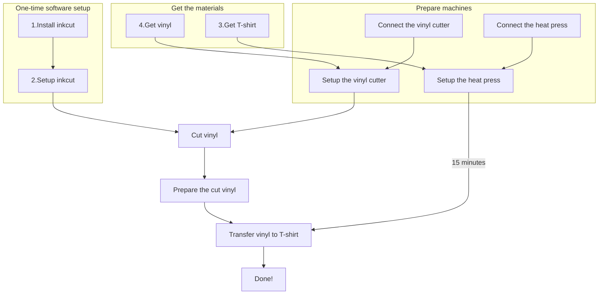

# vevor_vinyl_cutter_to_t_shirt_manual

Manual for using the Vevor vinyl cutter to create a T-shirt:

- [Website friendly](https://uppsala-makerspace.github.io/vevor_vinyl_cutter_to_t_shirt_manual/guide.html)
- [Printer friendly](guide.pdf) (PDF)
- [Superguide](super_guide.pdf) (PDF): also contains the vinyl cutter manual and a vinyl manual

[Contributions are welcome](CONTRIBUTING.md)!

## Overview

> Overview of the procedure

## Some SVGs

<!-- Some unavoidable long lines -->
<!-- markdownlint-disable MD013 -->

Filename                                                  |Thumbnail                                                                      |Description
----------------------------------------------------------|-------------------------------------------------------------------------------|---------------------------
[2024_logo_Complex_Black.svg](2024_logo_Complex_Black.svg)||2024 UMS logo, complex
[2024_logo_Simple_Black.svg](2024_logo_Simple_Black.svg)  |  |2024 UMS logo, simple
[2024_logo_Lazy_Black.svg](2024_logo_Lazy_Black.svg)      |      |2024 UMS logo, lazy
[UMS_logo_18.svg](UMS_logo_18.svg)                        |                        |2014 UMS logo, complex
[UMS_logo_18_no_letters.svg](UMS_logo_18_no_letters.svg)  |  |2014 UMS logo, simple
[UMS_logo_18_lite.svg](UMS_logo_18_lite.svg)              |        |2014 UMS logo, lazy
[R_written.svg](R_written.svg)                            |                            |A handwritten character `R`
[timeseries_horizontal.svg](timeseries_horizontal.svg)    |    |A timeseries
[timeseries_vertical.svg](timeseries_vertical.svg)        |        |A timeseries
[utusho.svg](utusho.svg)                                  |                                  |Logo inspired by [Utsuho Reiuji](https://en.touhouwiki.net/wiki/Utsuho_Reiuji)

<!-- markdownlint-enable MD013 -->

## Files used by continuous integration scripts

Filename                              |Descriptions
--------------------------------------|--------------------------------------------------------------------------------------------------------------------------------------
[mlc_config.json](mlc_config.json)    |Configuration of the link checker, use `markdown-link-check --config mlc_config.json --quiet docs/**/*.md` to do link checking locally
[.spellcheck.yml](.spellcheck.yml)    |Configuration of the spell checker, use `pyspelling -c .spellcheck.yml` to do spellcheck locally
[.wordlist.txt](.wordlist.txt)        |Whitelisted words for the spell checker, use `pyspelling -c .spellcheck.yml` to do spellcheck locally
[.markdownlint.jsonc](.markdownlint.jsonc)|Configuration of the markdown linter, use `markdownlint "**/*.md"` to do markdown linting locally. The name of this file is a default name.
[.markdownlintignore](.markdownlintignore)|Files ignored by the markdown linter, use `markdownlint "**/*.md"` to do markdown linting locally. The name of this file is a default name.
