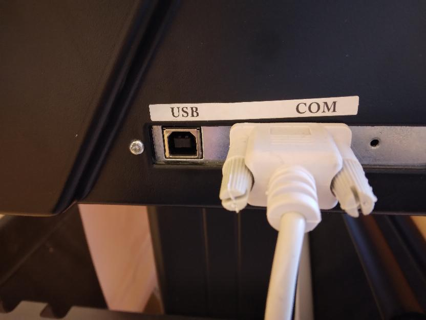
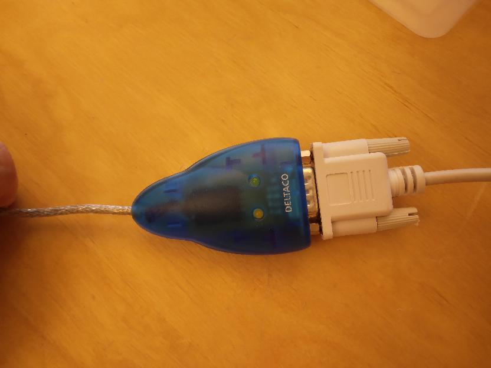
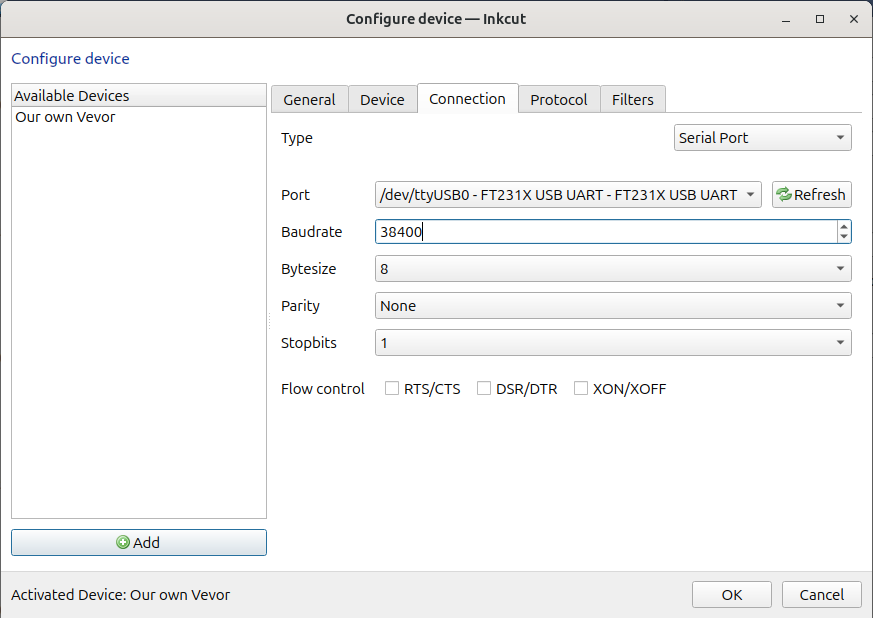

# vevor_vinyl_cutter_to_t_shirt_manual

Our Vevor vinyl cutter from the front|Our Vevor vinyl cutter from an isometric perspective
-------------------------------------|-------------------------------------
    |

Manual for using the Vevor vinyl cutter to create a T-shirt

Procedure:

- 1. Install Inkcut
- 2. Setup Inkcut
- 3. Use Inkcut
- 4. Transfer vinyl to T-shirt

## 1. Install Inkcut

- See [Install Inkcut notes](install_inkcut_notes.md) for the notes behind this

Install the Debian packages:

```bash
apt-get install python3-pip python3-pyqt5 python3-setuptools libcups2-dev python3-pyqt5.qtsvg
```

Create a (mandatory!) virtual environment for Inkcut:

```bash
python3 -m venv ~/inkcut_venv
```

Install the Inkcut and PyQt5 Python packages in the virtual environment"

```bash
~/inkcut_venv/bin/pip install inkcut PyQt5
```

Now you can start `inkcut` with:

```bash
~/inkcut_venv/bin/inkcut 
```


## 2. Setup Inkcut

- See [Setup Inkcut notes](setup_inkcut_notes.md) for the notes behind this

Add yourself to the `dialout` group:

```bash
sudo usermod -a -G dialout "$USER"
```

Restart (yes, a cold boot!).


Plug in the correct USB cable from the vinyl cutter to your computer:

Vinyl cutter side|Center|Computer side
---|---|---
||

Go to the 'Configure device | Connection':

- Type: Serial port
- Port: `ttyUSB0`. If you cannot select `ttyUSB0`, you've used the wrong USB cable
  coming out of the vinyl cutter :-)
- Baudrate: 38400



> Use the serial port with a baudrate of 38400.
> If you cannot select `ttyUSB0`, you've used the wrong USB cable
> coming out of the vinyl cutter

## 3. Use Inkcut


> Inkcut in action

## 4. Transfer vinyl to T-shirt


> Press not yet ready


[No idea yet]


> Transfer is ready

## Troubleshooting

### The vinyl cutter is confused


This may happen when you send multiple prints at the same time.
Press reset, close Inkcut, press reset, start Inkcut and try again

## Files used by continuous integration scripts

Filename                              |Descriptions
--------------------------------------|--------------------------------------------------------------------------------------------------------------------------------------
[mlc_config.json](mlc_config.json)    |Configuration of the link checker, use `markdown-link-check --config mlc_config.json --quiet docs/**/*.md` to do link checking locally
[.spellcheck.yml](.spellcheck.yml)    |Configuration of the spell checker, use `pyspelling -c .spellcheck.yml` to do spellcheck locally
[.wordlist.txt](.wordlist.txt)        |Whitelisted words for the spell checker, use `pyspelling -c .spellcheck.yml` to do spellcheck locally
[.markdownlint.jsonc](.markdownlint.jsonc)|Configuration of the markdown linter, use `markdownlint "**/*.md"` to do markdown linting locally. The name of this file is a default name.
[.markdownlintignore](.markdownlintignore)|Files ignored by the markdown linter, use `markdownlint "**/*.md"` to do markdown linting locally. The name of this file is a default name.
