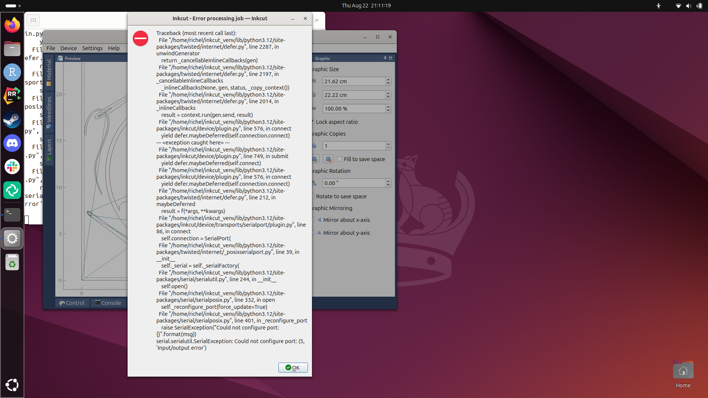
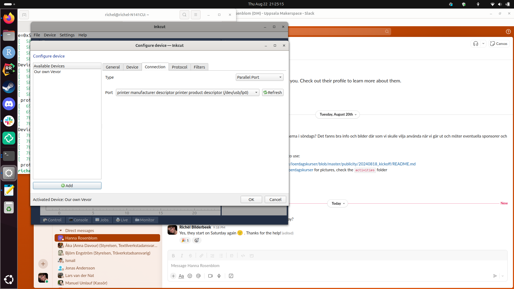
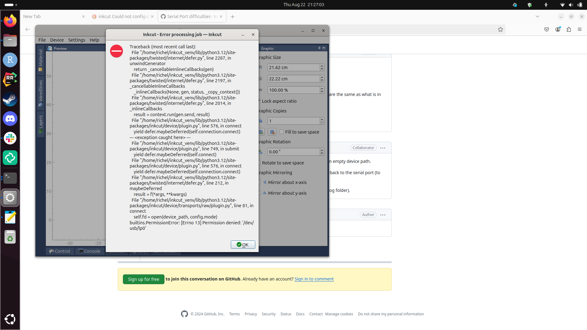

# vevor_vinyl_cutter_to_t_shirt_manual

Our Vevor vinyl cutter from the front|Our Vevor vinyl cutter from an isometric perpective
-------------------------------------|-------------------------------------
    |

Manual for using the Vevor vinyl cutter to create a T-shirt

Produre:

- 1. Instal Inkcut
- 2. Setup Inkcut
- 3. Use Inkcut
- 4. Tranfer vinyl to T-shirt

## 1. Install Inkcut

- See [Install Inkcut notes](install_inkcut_notes.md) for the notes behind this

Install the Debian packages:

```bash
apt-get install python3-pip python3-pyqt5 python3-setuptools libcups2-dev python3-pyqt5.qtsvg
```

Create a (mandatory!) virtual environment for Inkcut:

```
python3 -m venv ~/inkcut_venv
```

Install the Inkcut and PyQt5 Python packages in the virtual environment"

```
~/inkcut_venv/bin/pip install inkcut PyQt5
```

Now you can start `inkcut` with:

```
~/inkcut_venv/bin/inkcut 
```


## 2. Setup Inkcut

Starting fails: Inkcut cannot open the port


```
sudo usermod -a -G dialout "$USER"
```

Error at https://inkcut.org/t/could-not-open-port-devttyacm0-errno-13-permission-denied-devttyacm0/124/ :

> Resolved
> after running
> sudo usermod -a -G dialout "$USER"
> Logging out, and in, didn't do it, though a cold boot did.

Then next error:


```
2024-08-22 21:11:59,948 | CRITICAL | inkcut | Traceback (most recent call last):
  File "/home/richel/inkcut_venv/lib/python3.12/site-packages/twisted/internet/defer.py", line 2287, in unwindGenerator
    return _cancellableInlineCallbacks(gen)
  File "/home/richel/inkcut_venv/lib/python3.12/site-packages/twisted/internet/defer.py", line 2197, in _cancellableInlineCallbacks
    _inlineCallbacks(None, gen, status, _copy_context())
  File "/home/richel/inkcut_venv/lib/python3.12/site-packages/twisted/internet/defer.py", line 2014, in _inlineCallbacks
    result = context.run(gen.send, result)
  File "/home/richel/inkcut_venv/lib/python3.12/site-packages/inkcut/device/plugin.py", line 576, in connect
    yield defer.maybeDeferred(self.connection.connect)
--- <exception caught here> ---
  File "/home/richel/inkcut_venv/lib/python3.12/site-packages/inkcut/device/plugin.py", line 749, in submit
    yield defer.maybeDeferred(self.connect)
  File "/home/richel/inkcut_venv/lib/python3.12/site-packages/inkcut/device/plugin.py", line 576, in connect
    yield defer.maybeDeferred(self.connection.connect)
  File "/home/richel/inkcut_venv/lib/python3.12/site-packages/twisted/internet/defer.py", line 212, in maybeDeferred
    result = f(*args, **kwargs)
  File "/home/richel/inkcut_venv/lib/python3.12/site-packages/inkcut/device/transports/serialport/plugin.py", line 86, in connect
    self.connection = SerialPort(
  File "/home/richel/inkcut_venv/lib/python3.12/site-packages/twisted/internet/_posixserialport.py", line 39, in __init__
    self._serial = self._serialFactory(
  File "/home/richel/inkcut_venv/lib/python3.12/site-packages/serial/serialutil.py", line 244, in __init__
    self.open()
  File "/home/richel/inkcut_venv/lib/python3.12/site-packages/serial/serialposix.py", line 332, in open
    self._reconfigure_port(force_update=True)
  File "/home/richel/inkcut_venv/lib/python3.12/site-packages/serial/serialposix.py", line 401, in _reconfigure_port
    raise SerialException("Could not configure port: {}".format(msg))
serial.serialutil.SerialException: Could not configure port: (5, 'Input/output error')
```



Use a parallel port instead, from the blue USB:



Permission denied on that parallel port:



I guess, from https://askubuntu.com/questions/73687/what-is-the-correct-way-to-change-permissions-of-the-printer-in-dev-usb-lp0#73694 :

```
sudo usermod -a -G lpadmin "$USER"
```

No, use the serial port!


> Use the serial port with a baudrate of 38400.
> If you cannot select `ttyUSB0`, you've used the wrong USB cable
> coming out of the viny cutter

## 3. Use Inkcut


> Inkcut in action

## 4. Tranfer vinyl to T-shirt
