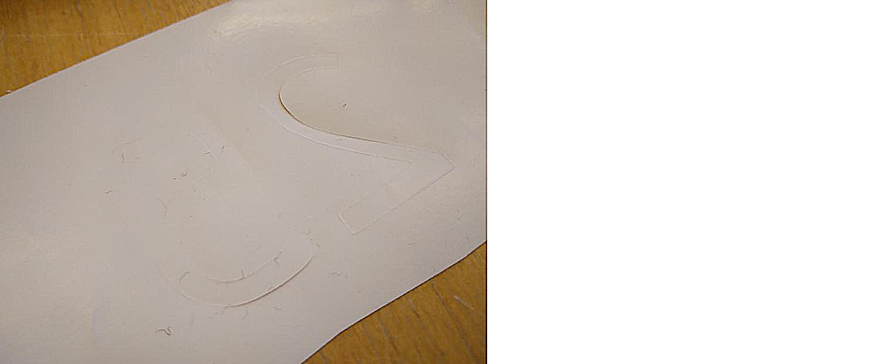

---
tags:
  - peel
  - vinyl
---

# 11. Peel vinyl

You now have vinyl with your pattern cut out.

Remove all the vinyl that should **not** be on the T-shirt.
Use your favorite tools for this.

In the end, ths how your vinyl looks lik after peeling:

