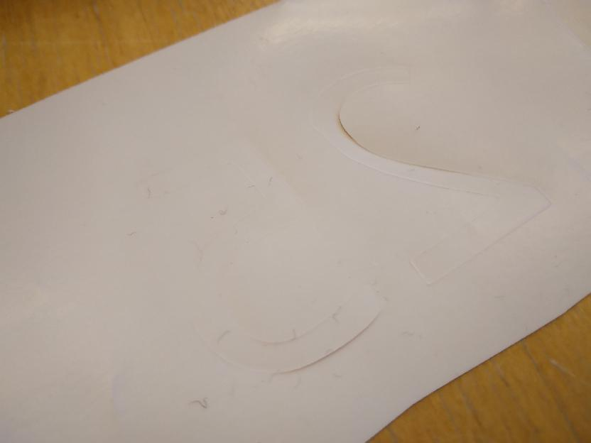
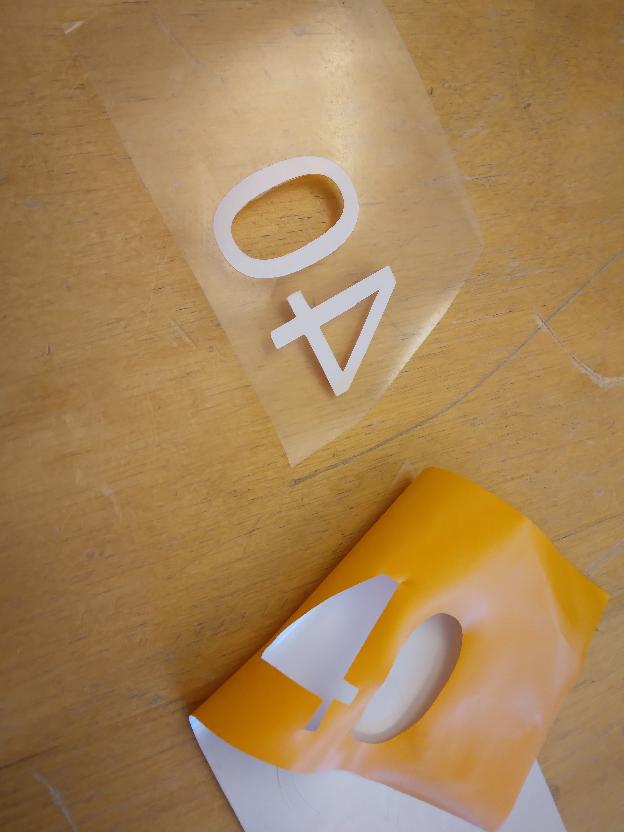

---
tags:
  - peel
  - vinyl
---

# 11. Peel vinyl

You now have vinyl with your pattern cut out.

???- question "How does that look like?

    

Remove all the vinyl that should not be on the T-shirt.
Use your favorite tools for this.

???- question "How does that look like?

    
