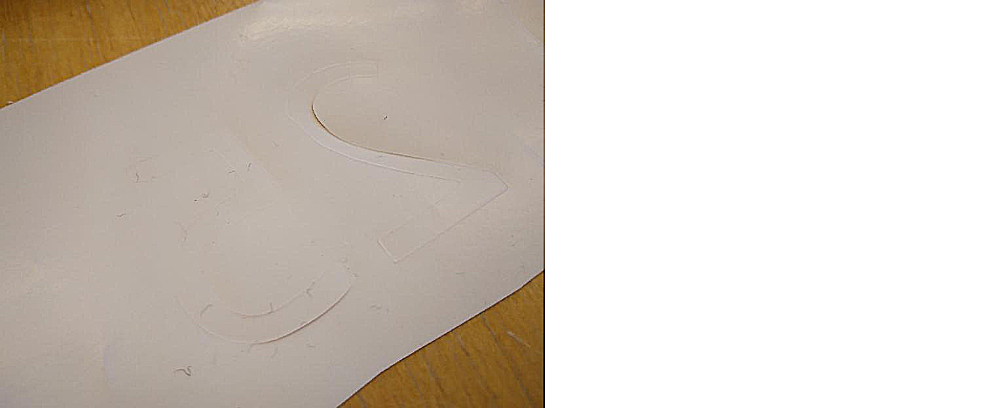
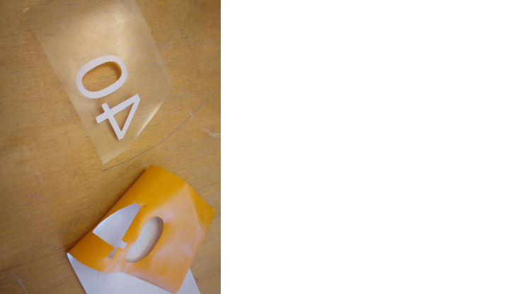

---
tags:
  - peel
  - vinyl
---

# 11. Peel vinyl

In this step of
[this vinyl cutter to T-shirt manual](https://richelbilderbeek.github.io/vevor_vinyl_cutter_to_t_shirt_manual/),
we peel away the useless part of our cut vinyl foil.

You now have vinyl with your pattern cut out.

Remove all the vinyl that should **not** be on the T-shirt.
Use your favorite tools for this.

In the end, this how your vinyl looks like after peeling:

