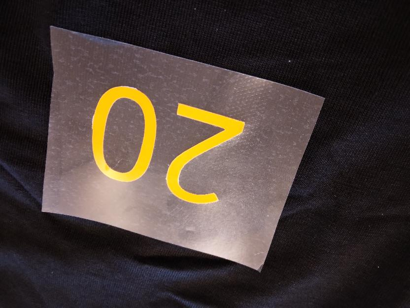
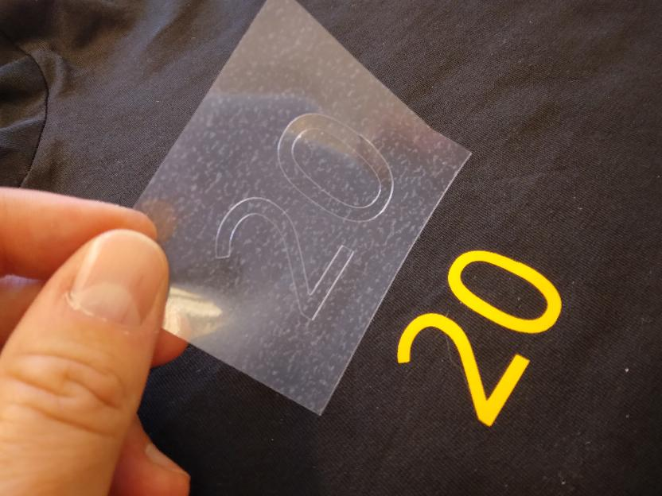

---
tags:
  - transfer
  - t-shirt
  - vinyl
---

# 12. Transfer vinyl to T-shirt

Put the remainder of the foil on the T-shirt,
with the colorful side up.

???- question "How does that look like?"

    

Confirm the heat press is warmed up.

???- question "How to determine if the press is warmed up?"

    

    > Press not yet ready. It should say `T=160/160C`.
    > A temperature from
    > 155 to 165 degrees Celcius would also be fine.

Place the T-shirt under the press,
with the foil still at the desired location on the t-shirt.

When the heat press is warmed up,
lower the press. After the time you've set up in an earlier step,
the press will start to beep. Raise the press again.

Wait for the print to cool off.

Carefully peel off the transparent layer from the shirt.

???- question "How does that look like?"

    

Done!

???- question "How does this look like?"

    
