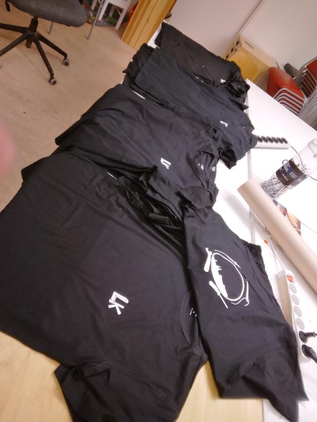

---
tags:
  - transfer
  - t-shirt
  - vinyl
---

# 11. Transfer vinyl to T-shirt

Put the remainder of the foil on the T-shirt,
with the colorful side up.

Heat up the heat press, this takes about 15 minutes.

Place the T-shirt under the press,
with the foil at the desired location on the t-shirt.

???- question "How to determine if the press is warmed up?"

    

    > Press not yet ready. It should say `T=160/160C`.
    > A temperature from
    > 155 to 165 degrees Celcius would also be fine.

When the heat press is warmed up,
lower the press. After the time you've set up in an earlier step,
the press will start to beep. Raise the press again.

Wait for the print to cool off.

Carefully peel off the transparent layer from the shirt.

Done!

???- question "How does this look like?"

    
