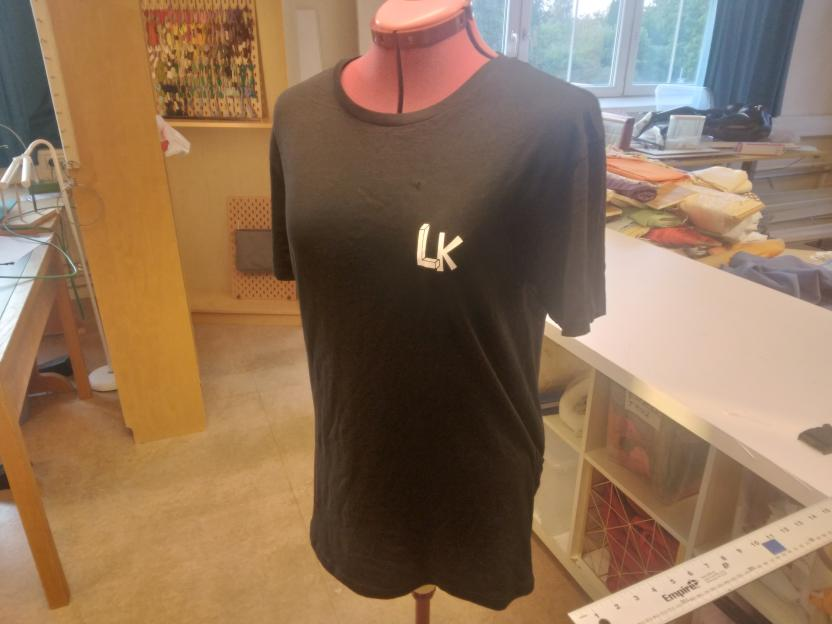

# 12. Transfer vinyl to T-shirt

In this step of
[Vinyl cutter to T-shirt manual](https://richelbilderbeek.github.io/vevor_vinyl_cutter_to_t_shirt_manual/),
we transfer our vinyl to our T-shirt.

Put the remainder of the foil on the T-shirt,
with the colorful side up:

Consider using a Primadocka to help place the foil on the
right spot of a T-shirt:

Confirm the heat press is warmed up: it's temperature
should match the desired temperature.

Place the T-shirt under the press,
with the foil still at the desired location on the t-shirt.

When the heat press is warmed up,
lower the press. After the time you've set up in an earlier step,
the press will start to beep. Raise the press again.

Wait for the print to cool off.

Peel off the transparent layer from the shirt:

Done!

