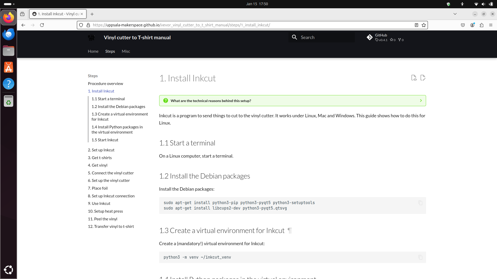
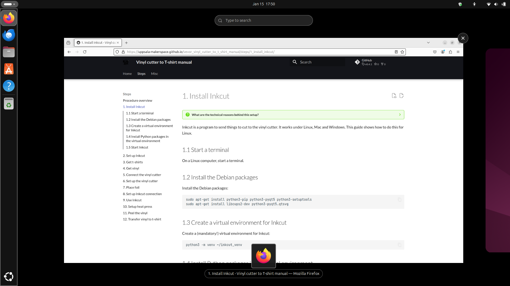
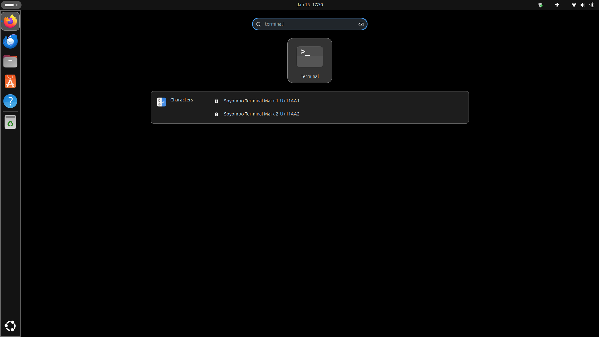
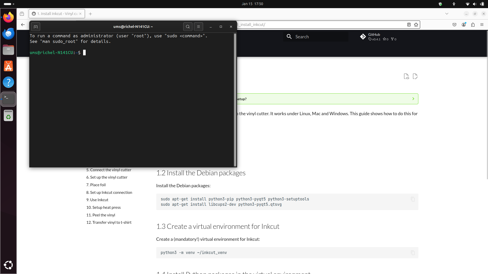
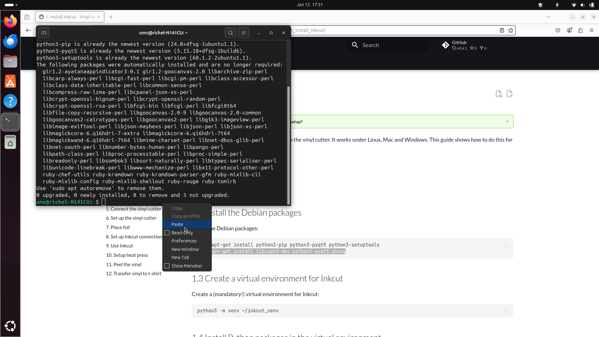
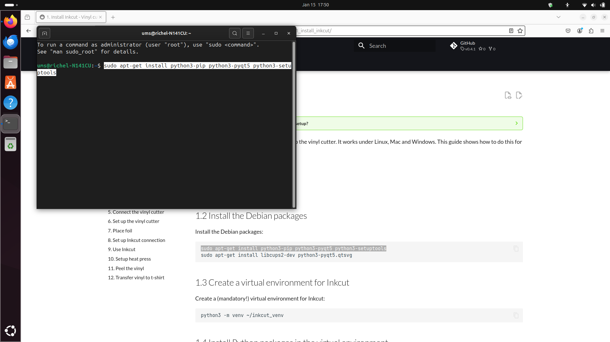
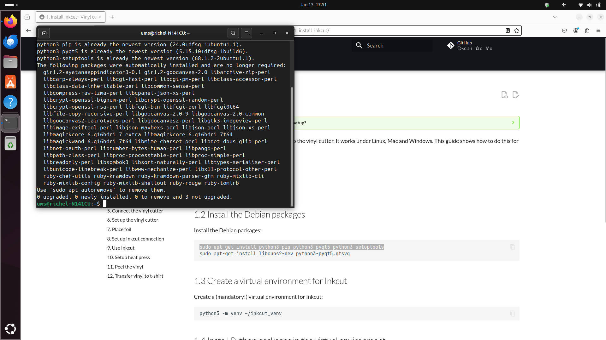

---
tags:
  - install
  - Inkcut
  - software
---

# 1. Install Inkcut

???- question "What are the technical reasons behind this setup?"

    See [my notes](install_inkcut_notes.md) for details.

Inkcut is a program to send things to cut to the vinyl cutter.
It works under Linux, Mac and Windows.
This guide shows how to do this for Linux.

## 1.1 Start a terminal

On a Linux computer, start a terminal:

???- question "How does this look like?"

    

- Press the Meta/Windows key (between Ctrl and Alt at the bottom
  left of the keyboard)

???- question "How does this look like?"

    

- Type terminal

???- question "How does this look like?"

    

Now you have started a terminal

???- question "How does this look like?"

    


## 1.2 Install the Debian packages

Copy-paste the following command to the terminal:

```bash
sudo apt-get install python3-pip python3-pyqt5 python3-setuptools
```

???- question "How do I paste?"

    Press the right mouse button and click on 'Paste'

    

    Or: use `Ctrl-Shift-V`

???- question "Huh, `Ctrl-V` does not work for pasting?"

    Correct, in a Linux terminal, one needs to use `Ctrl-Shift-V`

???- question "How does that look like?"

    


Probably you will need to type a password and press enter.

???- question "How does that look like?"

    ```bash
    ums@richel-N141CU:~$ sudo apt-get install python3-pip python3-pyqt5 python3-setuptools
    [sudo] password for ums: 
    ```

???- question "Huh? There are no asterisks appearing when I type?"

    Correct: when typing, no characters such as asterisks appear.
    This is for security reasons.

You will probably be asked if you want to install these programs.
Type 'Y' and press enter.

You will see a lot of programs being installed.

???- question "How does that look like?"

    It will look similar to this:
    ```bash
    ums@richel-N141CU:~$ sudo apt-get install python3-pip python3-pyqt5 python3-setuptools
    [sudo] password for ums: 
    Reading package lists... Done
    Building dependency tree... Done
    Reading state information... Done
    python3-pip is already the newest version (24.0+dfsg-1ubuntu1.1).
    python3-pyqt5 is already the newest version (5.15.10+dfsg-1build6).
    python3-setuptools is already the newest version (68.1.2-2ubuntu1.1).
    The following packages were automatically installed and are no longer required:
      gir1.2-ayatanaappindicator3-0.1 gir1.2-goocanvas-2.0 libarchive-zip-perl
      libcarp-always-perl libcgi-fast-perl libcgi-pm-perl libclass-accessor-perl
      libclass-data-inheritable-perl libcommon-sense-perl
      libcompress-raw-lzma-perl libcpanel-json-xs-perl
      libcrypt-openssl-bignum-perl libcrypt-openssl-random-perl
      libcrypt-openssl-rsa-perl libfcgi-bin libfcgi-perl libfcgi0t64
      libfile-copy-recursive-perl libgoocanvas-2.0-9 libgoocanvas-2.0-common
      libgoocanvas2-cairotypes-perl libgoocanvas2-perl libgtk3-imageview-perl
      libimage-exiftool-perl libjson-maybexs-perl libjson-perl libjson-xs-perl
      libmagickcore-6.q16hdri-7-extra libmagickcore-6.q16hdri-7t64
      libmagickwand-6.q16hdri-7t64 libmime-charset-perl libnet-dbus-glib-perl
      libnet-oauth-perl libnumber-bytes-human-perl libpango-perl
      libpath-class-perl libproc-processtable-perl libproc-simple-perl
      libreadonly-perl libsombok3 libsort-naturally-perl libtypes-serialiser-perl
      libunicode-linebreak-perl libwww-mechanize-perl libx11-protocol-other-perl
      ruby-chef-utils ruby-kramdown ruby-kramdown-parser-gfm ruby-mixlib-cli
      ruby-mixlib-config ruby-mixlib-shellout ruby-rouge ruby-tomlrb
    Use 'sudo apt autoremove' to remove them.
    0 upgraded, 0 newly installed, 0 to remove and 3 not upgraded.
    ```

Well done!

???- question "How does that look like?"



Now repeat with this command:

```bash
sudo apt-get install libcups2-dev python3-pyqt5.qtsvg
```


???- question "How does that look like?"

    Similar to this:

    ```bash
    ums@richel-N141CU:~$ sudo apt-get install libcups2-dev python3-pyqt5.qtsvg
    Reading package lists... Done
    Building dependency tree... Done
    Reading state information... Done
    libcups2-dev is already the newest version (2.4.7-1.2ubuntu7.3).
    python3-pyqt5.qtsvg is already the newest version (5.15.10+dfsg-1build6).
    The following packages were automatically installed and are no longer required:
      gir1.2-ayatanaappindicator3-0.1 gir1.2-goocanvas-2.0 libarchive-zip-perl
      libcarp-always-perl libcgi-fast-perl libcgi-pm-perl libclass-accessor-perl
      libclass-data-inheritable-perl libcommon-sense-perl
      libcompress-raw-lzma-perl libcpanel-json-xs-perl
      libcrypt-openssl-bignum-perl libcrypt-openssl-random-perl
      libcrypt-openssl-rsa-perl libfcgi-bin libfcgi-perl libfcgi0t64
      libfile-copy-recursive-perl libgoocanvas-2.0-9 libgoocanvas-2.0-common
      libgoocanvas2-cairotypes-perl libgoocanvas2-perl libgtk3-imageview-perl
      libimage-exiftool-perl libjson-maybexs-perl libjson-perl libjson-xs-perl
      libmagickcore-6.q16hdri-7-extra libmagickcore-6.q16hdri-7t64
      libmagickwand-6.q16hdri-7t64 libmime-charset-perl libnet-dbus-glib-perl
      libnet-oauth-perl libnumber-bytes-human-perl libpango-perl
      libpath-class-perl libproc-processtable-perl libproc-simple-perl
      libreadonly-perl libsombok3 libsort-naturally-perl libtypes-serialiser-perl
      libunicode-linebreak-perl libwww-mechanize-perl libx11-protocol-other-perl
      ruby-chef-utils ruby-kramdown ruby-kramdown-parser-gfm ruby-mixlib-cli
      ruby-mixlib-config ruby-mixlib-shellout ruby-rouge ruby-tomlrb
    Use 'sudo apt autoremove' to remove them.
    0 upgraded, 0 newly installed, 0 to remove and 3 not upgraded.
    ```

## 1.3 Create a virtual environment for Inkcut

Create a (mandatory!) virtual environment for Inkcut:

```bash
python3 -m venv ~/inkcut_venv
```

???- question "Huh? It says nothing!"

    Correct! This is 'The Golden Rule of Silence':
    when everything works, say nothing (over saying 'OK')


???- question "How does that look like?"

    Similar to this:

    ```bash
    ums@richel-N141CU:~$ python3 -m venv ~/inkcut_venv
    ums@richel-N141CU:~$ 
    ```


## 1.4 Install Python packages in the virtual environment

Install the Inkcut and PyQt5 Python packages in the virtual environment"

```bash
~/inkcut_venv/bin/pip install inkcut PyQt5
```

???- question "How does that look like?"

    It will look similar to this:

    ```bash
    ums@richel-N141CU:~$ ~/inkcut_venv/bin/pip install inkcut PyQt5
    Collecting inkcut
      Downloading inkcut-2.1.5-py2.py3-none-any.whl.metadata (2.7 kB)
    Collecting PyQt5
      Downloading PyQt5-5.15.11-cp38-abi3-manylinux_2_17_x86_64.whl.metadata (2.1 kB)
    Collecting twisted (from inkcut)
      Downloading twisted-24.11.0-py3-none-any.whl.metadata (20 kB)
    Collecting enamlx>=0.4.2 (from inkcut)
      Downloading enamlx-0.6.4-py2.py3-none-any.whl.metadata (1.9 kB)
    Collecting pyqtgraph (from inkcut)
      Downloading pyqtgraph-0.13.7-py3-none-any.whl.metadata (1.3 kB)
    Collecting qtconsole (from inkcut)
      Downloading qtconsole-5.6.1-py3-none-any.whl.metadata (5.0 kB)
    Collecting pyserial>=3.5 (from inkcut)
      Downloading pyserial-3.5-py2.py3-none-any.whl.metadata (1.6 kB)
    Collecting jsonpickle (from inkcut)
      Downloading jsonpickle-4.0.1-py3-none-any.whl.metadata (8.2 kB)
    Collecting lxml (from inkcut)
      Downloading lxml-5.3.0-cp312-cp312-manylinux_2_28_x86_64.whl.metadata (3.8 kB)
    Collecting qt-reactor (from inkcut)
      Downloading qt_reactor-0.6.1-py2.py3-none-any.whl.metadata (2.1 kB)
    Collecting enaml>=0.10 (from inkcut)
      Downloading enaml-0.18.0-cp312-cp312-manylinux_2_12_x86_64.manylinux2010_x86_64.manylinux_2_17_x86_64.manylinux2014_x86_64.whl.metadata (13 kB)
    Collecting pycups (from inkcut)
      Downloading pycups-2.0.4.tar.gz (65 kB)
         ━━━━━━━━━━━━━━━━━━━━━━━━━━━━━━━━━━━━━━━━ 65.1/65.1 kB 3.4 MB/s eta 0:00:00
      Installing build dependencies ... done
      Getting requirements to build wheel ... done
      Preparing metadata (pyproject.toml) ... done
    Collecting PyQt5-sip<13,>=12.15 (from PyQt5)
      Downloading PyQt5_sip-12.16.1-cp312-cp312-manylinux_2_5_x86_64.manylinux1_x86_64.whl.metadata (421 bytes)
    Collecting PyQt5-Qt5<5.16.0,>=5.15.2 (from PyQt5)
      Downloading PyQt5_Qt5-5.15.16-py3-none-manylinux2014_x86_64.whl.metadata (536 bytes)
    Collecting atom>=0.9.0 (from enaml>=0.10->inkcut)
      Downloading atom-0.11.0-cp312-cp312-manylinux_2_17_x86_64.manylinux2014_x86_64.whl.metadata (8.1 kB)
    Collecting kiwisolver>=1.2.0 (from enaml>=0.10->inkcut)
      Downloading kiwisolver-1.4.8-cp312-cp312-manylinux_2_17_x86_64.manylinux2014_x86_64.whl.metadata (6.2 kB)
    Collecting bytecode>=0.15.1 (from enaml>=0.10->inkcut)
      Downloading bytecode-0.16.0-py3-none-any.whl.metadata (4.7 kB)
    Collecting pegen>=0.3.0 (from enaml>=0.10->inkcut)
      Downloading pegen-0.3.0-py3-none-any.whl.metadata (11 kB)
    Collecting numpy>=1.22.0 (from pyqtgraph->inkcut)
      Downloading numpy-2.2.1-cp312-cp312-manylinux_2_17_x86_64.manylinux2014_x86_64.whl.metadata (62 kB)
         ━━━━━━━━━━━━━━━━━━━━━━━━━━━━━━━━━━━━━━━━ 62.0/62.0 kB 3.4 MB/s eta 0:00:00
    Collecting qtpy (from qt-reactor->inkcut)
      Downloading QtPy-2.4.2-py3-none-any.whl.metadata (12 kB)
    Collecting traitlets!=5.2.1,!=5.2.2 (from qtconsole->inkcut)
      Downloading traitlets-5.14.3-py3-none-any.whl.metadata (10 kB)
    Collecting jupyter-core (from qtconsole->inkcut)
      Downloading jupyter_core-5.7.2-py3-none-any.whl.metadata (3.4 kB)
    Collecting jupyter-client>=4.1 (from qtconsole->inkcut)
      Downloading jupyter_client-8.6.3-py3-none-any.whl.metadata (8.3 kB)
    Collecting pygments (from qtconsole->inkcut)
      Downloading pygments-2.19.1-py3-none-any.whl.metadata (2.5 kB)
    Collecting ipykernel>=4.1 (from qtconsole->inkcut)
      Downloading ipykernel-6.29.5-py3-none-any.whl.metadata (6.3 kB)
    Collecting packaging (from qtconsole->inkcut)
      Downloading packaging-24.2-py3-none-any.whl.metadata (3.2 kB)
    Collecting attrs>=22.2.0 (from twisted->inkcut)
      Downloading attrs-24.3.0-py3-none-any.whl.metadata (11 kB)
    Collecting automat>=24.8.0 (from twisted->inkcut)
      Downloading Automat-24.8.1-py3-none-any.whl.metadata (8.4 kB)
    Collecting constantly>=15.1 (from twisted->inkcut)
      Downloading constantly-23.10.4-py3-none-any.whl.metadata (1.8 kB)
    Collecting hyperlink>=17.1.1 (from twisted->inkcut)
      Downloading hyperlink-21.0.0-py2.py3-none-any.whl.metadata (1.5 kB)
    Collecting incremental>=24.7.0 (from twisted->inkcut)
      Downloading incremental-24.7.2-py3-none-any.whl.metadata (8.1 kB)
    Collecting typing-extensions>=4.2.0 (from twisted->inkcut)
      Downloading typing_extensions-4.12.2-py3-none-any.whl.metadata (3.0 kB)
    Collecting zope-interface>=5 (from twisted->inkcut)
      Downloading zope.interface-7.2-cp312-cp312-manylinux_2_5_x86_64.manylinux1_x86_64.manylinux_2_17_x86_64.manylinux2014_x86_64.whl.metadata (44 kB)
         ━━━━━━━━━━━━━━━━━━━━━━━━━━━━━━━━━━━━━━━━ 44.4/44.4 kB 2.2 MB/s eta 0:00:00
    Collecting idna>=2.5 (from hyperlink>=17.1.1->twisted->inkcut)
      Downloading idna-3.10-py3-none-any.whl.metadata (10 kB)
    Collecting setuptools>=61.0 (from incremental>=24.7.0->twisted->inkcut)
      Using cached setuptools-75.8.0-py3-none-any.whl.metadata (6.7 kB)
    Collecting comm>=0.1.1 (from ipykernel>=4.1->qtconsole->inkcut)
      Downloading comm-0.2.2-py3-none-any.whl.metadata (3.7 kB)
    Collecting debugpy>=1.6.5 (from ipykernel>=4.1->qtconsole->inkcut)
      Downloading debugpy-1.8.11-cp312-cp312-manylinux_2_5_x86_64.manylinux1_x86_64.manylinux_2_17_x86_64.manylinux2014_x86_64.whl.metadata (1.1 kB)
    Collecting ipython>=7.23.1 (from ipykernel>=4.1->qtconsole->inkcut)
      Downloading ipython-8.31.0-py3-none-any.whl.metadata (4.9 kB)
    Collecting matplotlib-inline>=0.1 (from ipykernel>=4.1->qtconsole->inkcut)
      Downloading matplotlib_inline-0.1.7-py3-none-any.whl.metadata (3.9 kB)
    Collecting nest-asyncio (from ipykernel>=4.1->qtconsole->inkcut)
      Downloading nest_asyncio-1.6.0-py3-none-any.whl.metadata (2.8 kB)
    Collecting psutil (from ipykernel>=4.1->qtconsole->inkcut)
      Downloading psutil-6.1.1-cp36-abi3-manylinux_2_12_x86_64.manylinux2010_x86_64.manylinux_2_17_x86_64.manylinux2014_x86_64.whl.metadata (22 kB)
    Collecting pyzmq>=24 (from ipykernel>=4.1->qtconsole->inkcut)
      Downloading pyzmq-26.2.0-cp312-cp312-manylinux_2_28_x86_64.whl.metadata (6.2 kB)
    Collecting tornado>=6.1 (from ipykernel>=4.1->qtconsole->inkcut)
      Downloading tornado-6.4.2-cp38-abi3-manylinux_2_5_x86_64.manylinux1_x86_64.manylinux_2_17_x86_64.manylinux2014_x86_64.whl.metadata (2.5 kB)
    Collecting python-dateutil>=2.8.2 (from jupyter-client>=4.1->qtconsole->inkcut)
      Downloading python_dateutil-2.9.0.post0-py2.py3-none-any.whl.metadata (8.4 kB)
    Collecting platformdirs>=2.5 (from jupyter-core->qtconsole->inkcut)
      Downloading platformdirs-4.3.6-py3-none-any.whl.metadata (11 kB)
    Collecting decorator (from ipython>=7.23.1->ipykernel>=4.1->qtconsole->inkcut)
      Downloading decorator-5.1.1-py3-none-any.whl.metadata (4.0 kB)
    Collecting jedi>=0.16 (from ipython>=7.23.1->ipykernel>=4.1->qtconsole->inkcut)
      Downloading jedi-0.19.2-py2.py3-none-any.whl.metadata (22 kB)
    Collecting pexpect>4.3 (from ipython>=7.23.1->ipykernel>=4.1->qtconsole->inkcut)
      Downloading pexpect-4.9.0-py2.py3-none-any.whl.metadata (2.5 kB)
    Collecting prompt_toolkit<3.1.0,>=3.0.41 (from ipython>=7.23.1->ipykernel>=4.1->qtconsole->inkcut)
      Downloading prompt_toolkit-3.0.48-py3-none-any.whl.metadata (6.4 kB)
    Collecting stack_data (from ipython>=7.23.1->ipykernel>=4.1->qtconsole->inkcut)
      Downloading stack_data-0.6.3-py3-none-any.whl.metadata (18 kB)
    Collecting six>=1.5 (from python-dateutil>=2.8.2->jupyter-client>=4.1->qtconsole->inkcut)
      Downloading six-1.17.0-py2.py3-none-any.whl.metadata (1.7 kB)
    Collecting parso<0.9.0,>=0.8.4 (from jedi>=0.16->ipython>=7.23.1->ipykernel>=4.1->qtconsole->inkcut)
      Downloading parso-0.8.4-py2.py3-none-any.whl.metadata (7.7 kB)
    Collecting ptyprocess>=0.5 (from pexpect>4.3->ipython>=7.23.1->ipykernel>=4.1->qtconsole->inkcut)
      Downloading ptyprocess-0.7.0-py2.py3-none-any.whl.metadata (1.3 kB)
    Collecting wcwidth (from prompt_toolkit<3.1.0,>=3.0.41->ipython>=7.23.1->ipykernel>=4.1->qtconsole->inkcut)
      Downloading wcwidth-0.2.13-py2.py3-none-any.whl.metadata (14 kB)
    Collecting executing>=1.2.0 (from stack_data->ipython>=7.23.1->ipykernel>=4.1->qtconsole->inkcut)
      Downloading executing-2.1.0-py2.py3-none-any.whl.metadata (8.9 kB)
    Collecting asttokens>=2.1.0 (from stack_data->ipython>=7.23.1->ipykernel>=4.1->qtconsole->inkcut)
      Downloading asttokens-3.0.0-py3-none-any.whl.metadata (4.7 kB)
    Collecting pure-eval (from stack_data->ipython>=7.23.1->ipykernel>=4.1->qtconsole->inkcut)
      Downloading pure_eval-0.2.3-py3-none-any.whl.metadata (6.3 kB)
    Downloading inkcut-2.1.5-py2.py3-none-any.whl (1.2 MB)
       ━━━━━━━━━━━━━━━━━━━━━━━━━━━━━━━━━━━━━━━━ 1.2/1.2 MB 3.5 MB/s eta 0:00:00
    Downloading PyQt5-5.15.11-cp38-abi3-manylinux_2_17_x86_64.whl (8.2 MB)
       ━━━━━━━━━━━━━━━━━━━━━━━━━━━━━━━━━━━━━━━━ 8.2/8.2 MB 19.2 MB/s eta 0:00:00
    Downloading enaml-0.18.0-cp312-cp312-manylinux_2_12_x86_64.manylinux2010_x86_64.manylinux_2_17_x86_64.manylinux2014_x86_64.whl (1.2 MB)
       ━━━━━━━━━━━━━━━━━━━━━━━━━━━━━━━━━━━━━━━━ 1.2/1.2 MB 10.1 MB/s eta 0:00:00
    Downloading enamlx-0.6.4-py2.py3-none-any.whl (47 kB)
       ━━━━━━━━━━━━━━━━━━━━━━━━━━━━━━━━━━━━━━━━ 47.9/47.9 kB 2.2 MB/s eta 0:00:00
    Downloading PyQt5_Qt5-5.15.16-py3-none-manylinux2014_x86_64.whl (59.9 MB)
       ━━━━━━━━━━━━━━━━━━━━━━━━━━━━━━━━━━━━━━━━ 59.9/59.9 MB 10.3 MB/s eta 0:00:00
    Downloading PyQt5_sip-12.16.1-cp312-cp312-manylinux_2_5_x86_64.manylinux1_x86_64.whl (281 kB)
       ━━━━━━━━━━━━━━━━━━━━━━━━━━━━━━━━━━━━━━━━ 281.6/281.6 kB 11.2 MB/s eta 0:00:00
    Downloading pyserial-3.5-py2.py3-none-any.whl (90 kB)
       ━━━━━━━━━━━━━━━━━━━━━━━━━━━━━━━━━━━━━━━━ 90.6/90.6 kB 5.4 MB/s eta 0:00:00
    Downloading jsonpickle-4.0.1-py3-none-any.whl (46 kB)
       ━━━━━━━━━━━━━━━━━━━━━━━━━━━━━━━━━━━━━━━━ 46.2/46.2 kB 2.9 MB/s eta 0:00:00
    Downloading lxml-5.3.0-cp312-cp312-manylinux_2_28_x86_64.whl (4.9 MB)
       ━━━━━━━━━━━━━━━━━━━━━━━━━━━━━━━━━━━━━━━━ 4.9/4.9 MB 24.7 MB/s eta 0:00:00
    Downloading pyqtgraph-0.13.7-py3-none-any.whl (1.9 MB)
       ━━━━━━━━━━━━━━━━━━━━━━━━━━━━━━━━━━━━━━━━ 1.9/1.9 MB 19.4 MB/s eta 0:00:00
    Downloading qt_reactor-0.6.1-py2.py3-none-any.whl (7.5 kB)
    Downloading qtconsole-5.6.1-py3-none-any.whl (125 kB)
       ━━━━━━━━━━━━━━━━━━━━━━━━━━━━━━━━━━━━━━━━ 125.0/125.0 kB 7.2 MB/s eta 0:00:00
    Downloading twisted-24.11.0-py3-none-any.whl (3.2 MB)
       ━━━━━━━━━━━━━━━━━━━━━━━━━━━━━━━━━━━━━━━━ 3.2/3.2 MB 21.9 MB/s eta 0:00:00
    Downloading atom-0.11.0-cp312-cp312-manylinux_2_17_x86_64.manylinux2014_x86_64.whl (1.5 MB)
       ━━━━━━━━━━━━━━━━━━━━━━━━━━━━━━━━━━━━━━━━ 1.5/1.5 MB 8.7 MB/s eta 0:00:00
    Downloading attrs-24.3.0-py3-none-any.whl (63 kB)
       ━━━━━━━━━━━━━━━━━━━━━━━━━━━━━━━━━━━━━━━━ 63.4/63.4 kB 3.2 MB/s eta 0:00:00
    Downloading Automat-24.8.1-py3-none-any.whl (42 kB)
       ━━━━━━━━━━━━━━━━━━━━━━━━━━━━━━━━━━━━━━━━ 42.6/42.6 kB 2.6 MB/s eta 0:00:00
    Downloading bytecode-0.16.0-py3-none-any.whl (41 kB)
       ━━━━━━━━━━━━━━━━━━━━━━━━━━━━━━━━━━━━━━━━ 41.6/41.6 kB 2.3 MB/s eta 0:00:00
    Downloading constantly-23.10.4-py3-none-any.whl (13 kB)
    Downloading hyperlink-21.0.0-py2.py3-none-any.whl (74 kB)
       ━━━━━━━━━━━━━━━━━━━━━━━━━━━━━━━━━━━━━━━━ 74.6/74.6 kB 3.7 MB/s eta 0:00:00
    Downloading incremental-24.7.2-py3-none-any.whl (20 kB)
    Downloading ipykernel-6.29.5-py3-none-any.whl (117 kB)
       ━━━━━━━━━━━━━━━━━━━━━━━━━━━━━━━━━━━━━━━━ 117.2/117.2 kB 7.0 MB/s eta 0:00:00
    Downloading jupyter_client-8.6.3-py3-none-any.whl (106 kB)
       ━━━━━━━━━━━━━━━━━━━━━━━━━━━━━━━━━━━━━━━━ 106.1/106.1 kB 5.5 MB/s eta 0:00:00
    Downloading jupyter_core-5.7.2-py3-none-any.whl (28 kB)
    Downloading kiwisolver-1.4.8-cp312-cp312-manylinux_2_17_x86_64.manylinux2014_x86_64.whl (1.5 MB)
       ━━━━━━━━━━━━━━━━━━━━━━━━━━━━━━━━━━━━━━━━ 1.5/1.5 MB 17.2 MB/s eta 0:00:00
    Downloading numpy-2.2.1-cp312-cp312-manylinux_2_17_x86_64.manylinux2014_x86_64.whl (16.1 MB)
       ━━━━━━━━━━━━━━━━━━━━━━━━━━━━━━━━━━━━━━━━ 16.1/16.1 MB 19.6 MB/s eta 0:00:00
    Downloading pegen-0.3.0-py3-none-any.whl (35 kB)
    Downloading QtPy-2.4.2-py3-none-any.whl (95 kB)
       ━━━━━━━━━━━━━━━━━━━━━━━━━━━━━━━━━━━━━━━━ 95.2/95.2 kB 4.7 MB/s eta 0:00:00
    Downloading traitlets-5.14.3-py3-none-any.whl (85 kB)
       ━━━━━━━━━━━━━━━━━━━━━━━━━━━━━━━━━━━━━━━━ 85.4/85.4 kB 5.0 MB/s eta 0:00:00
    Downloading typing_extensions-4.12.2-py3-none-any.whl (37 kB)
    Downloading zope.interface-7.2-cp312-cp312-manylinux_2_5_x86_64.manylinux1_x86_64.manylinux_2_17_x86_64.manylinux2014_x86_64.whl (264 kB)
       ━━━━━━━━━━━━━━━━━━━━━━━━━━━━━━━━━━━━━━━━ 264.7/264.7 kB 12.7 MB/s eta 0:00:00
    Downloading packaging-24.2-py3-none-any.whl (65 kB)
       ━━━━━━━━━━━━━━━━━━━━━━━━━━━━━━━━━━━━━━━━ 65.5/65.5 kB 3.9 MB/s eta 0:00:00
    Downloading pygments-2.19.1-py3-none-any.whl (1.2 MB)
       ━━━━━━━━━━━━━━━━━━━━━━━━━━━━━━━━━━━━━━━━ 1.2/1.2 MB 18.9 MB/s eta 0:00:00
    Downloading comm-0.2.2-py3-none-any.whl (7.2 kB)
    Downloading debugpy-1.8.11-cp312-cp312-manylinux_2_5_x86_64.manylinux1_x86_64.manylinux_2_17_x86_64.manylinux2014_x86_64.whl (4.2 MB)
       ━━━━━━━━━━━━━━━━━━━━━━━━━━━━━━━━━━━━━━━━ 4.2/4.2 MB 13.6 MB/s eta 0:00:00
    Downloading idna-3.10-py3-none-any.whl (70 kB)
       ━━━━━━━━━━━━━━━━━━━━━━━━━━━━━━━━━━━━━━━━ 70.4/70.4 kB 2.3 MB/s eta 0:00:00
    Downloading ipython-8.31.0-py3-none-any.whl (821 kB)
       ━━━━━━━━━━━━━━━━━━━━━━━━━━━━━━━━━━━━━━━━ 821.6/821.6 kB 16.4 MB/s eta 0:00:00
    Downloading matplotlib_inline-0.1.7-py3-none-any.whl (9.9 kB)
    Downloading platformdirs-4.3.6-py3-none-any.whl (18 kB)
    Downloading python_dateutil-2.9.0.post0-py2.py3-none-any.whl (229 kB)
       ━━━━━━━━━━━━━━━━━━━━━━━━━━━━━━━━━━━━━━━━ 229.9/229.9 kB 8.6 MB/s eta 0:00:00
    Downloading pyzmq-26.2.0-cp312-cp312-manylinux_2_28_x86_64.whl (860 kB)
       ━━━━━━━━━━━━━━━━━━━━━━━━━━━━━━━━━━━━━━━━ 860.6/860.6 kB 17.2 MB/s eta 0:00:00
    Using cached setuptools-75.8.0-py3-none-any.whl (1.2 MB)
    Downloading tornado-6.4.2-cp38-abi3-manylinux_2_5_x86_64.manylinux1_x86_64.manylinux_2_17_x86_64.manylinux2014_x86_64.whl (437 kB)
       ━━━━━━━━━━━━━━━━━━━━━━━━━━━━━━━━━━━━━━━━ 437.2/437.2 kB 13.2 MB/s eta 0:00:00
    Downloading nest_asyncio-1.6.0-py3-none-any.whl (5.2 kB)
    Downloading psutil-6.1.1-cp36-abi3-manylinux_2_12_x86_64.manylinux2010_x86_64.manylinux_2_17_x86_64.manylinux2014_x86_64.whl (287 kB)
       ━━━━━━━━━━━━━━━━━━━━━━━━━━━━━━━━━━━━━━━━ 287.5/287.5 kB 12.3 MB/s eta 0:00:00
    Downloading jedi-0.19.2-py2.py3-none-any.whl (1.6 MB)
       ━━━━━━━━━━━━━━━━━━━━━━━━━━━━━━━━━━━━━━━━ 1.6/1.6 MB 12.2 MB/s eta 0:00:00
    Downloading pexpect-4.9.0-py2.py3-none-any.whl (63 kB)
       ━━━━━━━━━━━━━━━━━━━━━━━━━━━━━━━━━━━━━━━━ 63.8/63.8 kB 2.8 MB/s eta 0:00:00
    Downloading prompt_toolkit-3.0.48-py3-none-any.whl (386 kB)
       ━━━━━━━━━━━━━━━━━━━━━━━━━━━━━━━━━━━━━━━━ 386.6/386.6 kB 6.4 MB/s eta 0:00:00
    Downloading six-1.17.0-py2.py3-none-any.whl (11 kB)
    Downloading decorator-5.1.1-py3-none-any.whl (9.1 kB)
    Downloading stack_data-0.6.3-py3-none-any.whl (24 kB)
    Downloading asttokens-3.0.0-py3-none-any.whl (26 kB)
    Downloading executing-2.1.0-py2.py3-none-any.whl (25 kB)
    Downloading parso-0.8.4-py2.py3-none-any.whl (103 kB)
       ━━━━━━━━━━━━━━━━━━━━━━━━━━━━━━━━━━━━━━━━ 103.7/103.7 kB 4.9 MB/s eta 0:00:00
    Downloading ptyprocess-0.7.0-py2.py3-none-any.whl (13 kB)
    Downloading pure_eval-0.2.3-py3-none-any.whl (11 kB)
    Downloading wcwidth-0.2.13-py2.py3-none-any.whl (34 kB)
    Building wheels for collected packages: pycups
      Building wheel for pycups (pyproject.toml) ... done
      Created wheel for pycups: filename=pycups-2.0.4-cp312-cp312-linux_x86_64.whl size=227729 sha256=592a9d9b5cbe4bf61a33d588a44814b2d78ae1f0b04725f0aed970eaec336de5
      Stored in directory: /home/ums/.cache/pip/wheels/7e/03/57/972b28956b7dbcf30027b904c2552a343495ffa2369b087c78
    Successfully built pycups
    Installing collected packages: wcwidth, pyserial, PyQt5-Qt5, pycups, pure-eval, ptyprocess, typing-extensions, traitlets, tornado, six, setuptools, pyzmq, PyQt5-sip, pygments, psutil, prompt_toolkit, platformdirs, pexpect, pegen, parso, packaging, numpy, nest-asyncio, lxml, kiwisolver, jsonpickle, idna, executing, decorator, debugpy, constantly, bytecode, automat, attrs, atom, asttokens, zope-interface, stack_data, qtpy, python-dateutil, pyqtgraph, PyQt5, matplotlib-inline, jupyter-core, jedi, incremental, hyperlink, enaml, comm, twisted, jupyter-client, ipython, enamlx, qt-reactor, ipykernel, qtconsole, inkcut
    Successfully installed PyQt5-5.15.11 PyQt5-Qt5-5.15.16 PyQt5-sip-12.16.1 asttokens-3.0.0 atom-0.11.0 attrs-24.3.0 automat-24.8.1 bytecode-0.16.0 comm-0.2.2 constantly-23.10.4 debugpy-1.8.11 decorator-5.1.1 enaml-0.18.0 enamlx-0.6.4 executing-2.1.0 hyperlink-21.0.0 idna-3.10 incremental-24.7.2 inkcut-2.1.5 ipykernel-6.29.5 ipython-8.31.0 jedi-0.19.2 jsonpickle-4.0.1 jupyter-client-8.6.3 jupyter-core-5.7.2 kiwisolver-1.4.8 lxml-5.3.0 matplotlib-inline-0.1.7 nest-asyncio-1.6.0 numpy-2.2.1 packaging-24.2 parso-0.8.4 pegen-0.3.0 pexpect-4.9.0 platformdirs-4.3.6 prompt_toolkit-3.0.48 psutil-6.1.1 ptyprocess-0.7.0 pure-eval-0.2.3 pycups-2.0.4 pygments-2.19.1 pyqtgraph-0.13.7 pyserial-3.5 python-dateutil-2.9.0.post0 pyzmq-26.2.0 qt-reactor-0.6.1 qtconsole-5.6.1 qtpy-2.4.2 setuptools-75.8.0 six-1.17.0 stack_data-0.6.3 tornado-6.4.2 traitlets-5.14.3 twisted-24.11.0 typing-extensions-4.12.2 wcwidth-0.2.13 zope-interface-7.2
    ```

## 1.5 Start Inkcut

Now you can start `inkcut` with:

```bash
~/inkcut_venv/bin/inkcut 
```

???- question "How does that look like?"

    The terminal will be similar to this:

    ```bash
    ums@richel-N141CU:~$ ~/inkcut_venv/bin/inkcut 
    Logging to /home/ums/.config/inkcut/logs/inkcut.txt
    2025-01-15 17:52:53,379 | INFO    | inkcut | ========================================
    2025-01-15 17:52:53,379 | INFO    | inkcut | Inkcut launched
    2025-01-15 17:52:53,379 | INFO    | inkcut | Version: 2.1.5
    2025-01-15 17:52:53,379 | INFO    | inkcut | Python: 3.12.3 (main, Nov  6 2024, 18:32:19) [GCC 13.2.0]
    2025-01-15 17:52:53,379 | INFO    | inkcut | System: uname_result(system='Linux', node='richel-N141CU', release='6.8.0-51-generic', version='#52-Ubuntu SMP PREEMPT_DYNAMIC Thu Dec  5 13:09:44 UTC 2024', machine='x86_64')
    2025-01-15 17:52:53,379 | INFO    | inkcut | Executable: /home/ums/inkcut_venv/bin/python3
    2025-01-15 17:52:53,379 | INFO    | inkcut | Args: ['/home/ums/inkcut_venv/bin/inkcut']
    2025-01-15 17:52:53,408 | INFO    | inkcut | Qt: 5.15.14 Api:
    2025-01-15 17:52:53,409 | INFO    | inkcut | ========================================
    Warning: Ignoring XDG_SESSION_TYPE=wayland on Gnome. Use QT_QPA_PLATFORM=wayland to run on Wayland anyway.
    2025-01-15 17:52:54,326 | DEBUG   | inkcut | Starting plugin 'inkcut.core'
    2025-01-15 17:52:54,326 | DEBUG   | inkcut | Inkcut loaded.
    2025-01-15 17:52:54,365 | DEBUG   | inkcut | CLI | Commands loaded
    2025-01-15 17:52:54,366 | DEBUG   | inkcut | CLI | No cli command was given.
    2025-01-15 17:52:54,368 | WARNING | inkcut | Translations not found at /home/ums/inkcut_venv/lib/python3.12/site-packages/inkcut/res/translations/en_US
    2025-01-15 17:52:56,009 | DEBUG   | inkcut | CLI | Commands loaded
    2025-01-15 17:52:56,010 | DEBUG   | inkcut | CLI | No cli command was given.
    2025-01-15 17:52:56,021 | INFO    | inkcut | Loading plugin inkcut.monitor
    2025-01-15 17:52:56,022 | DEBUG   | inkcut | Starting plugin 'inkcut.monitor'
    2025-01-15 17:52:56,291 | INFO    | inkcut | Loading plugin inkcut.device
    ```

    Then InkCut will start:

    

InkCut is now started. Well done!
