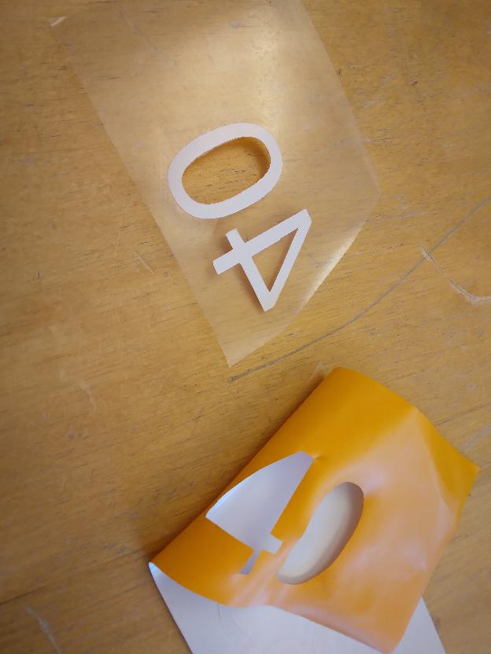

# 4. Get vinyl

Get suitable vinyl

Suitable foil looks like this:

- The foil feels smoother than a sticker ('klistermärke')
- The foil is shinier than a sticker

A good place to vinyl is at [https://www.scandraft.se/](https://www.scandraft.se/),
where we have bought
[Siser P.S. Film Easyweed](https://www.scandraft.se/products/heat-transfer-vinyl/siser-cut-transfer/siser-ps-film-easyweed-a0021),
which works well.
You can order longer rolls: we've ordered rolls of 25 meters,
for an unknown price (if you know the price, please [contribute](../CONTRIBUTING.md)).
