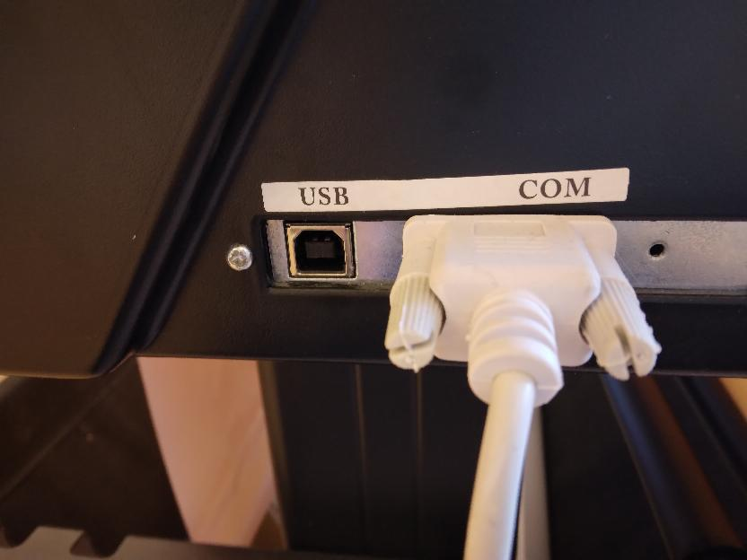
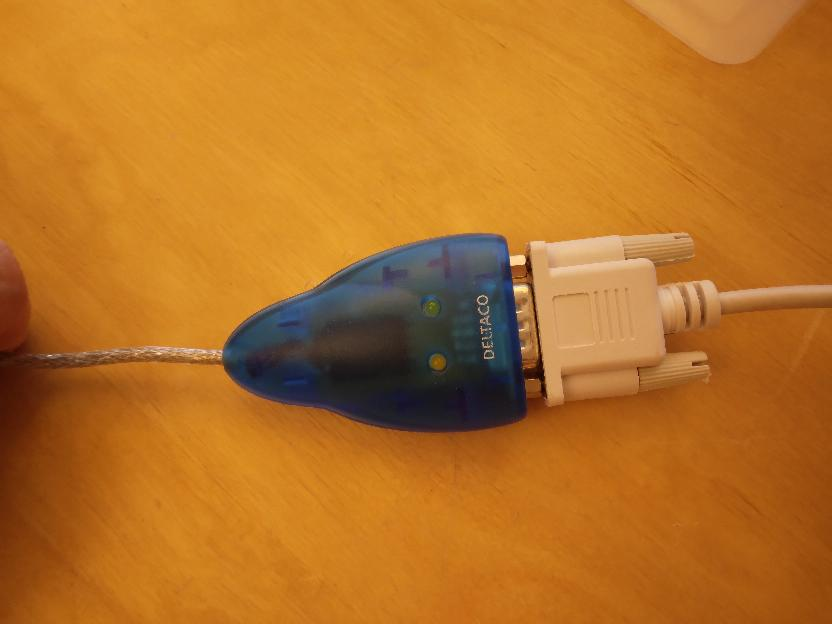
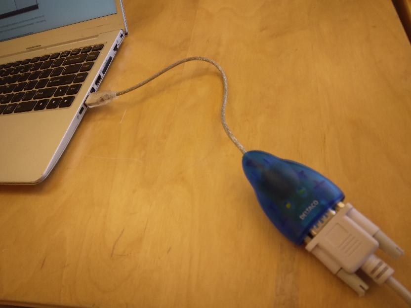

---
tags:
  - connect
  - vinyl cutter
---

# 5. Connect the vinyl cutter

In this step of
[this vinyl cutter to T-shirt manual](https://uppsala-makerspace.github.io/vevor_vinyl_cutter_to_t_shirt_manual/),
we physically connect our laptop to the vinyl cutter.

There are two ways to connect the vinyl cutter to a computer.

## 8.1 Use the USB port

Plug in the USB cable from the vinyl cutter's USB port to your computer.
This is a regular/simple USB cable.

## 8.2 Use the COM port

Plug in the correct USB cable from the vinyl cutter's COM port to your computer:

Vinyl cutter side|Center|Computer side
-----------------|------|-------------
||
