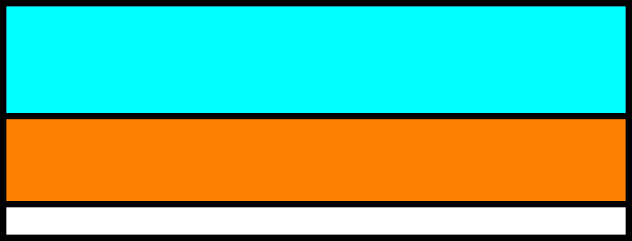
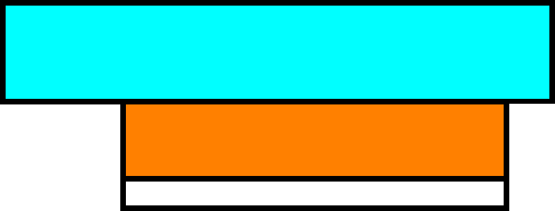
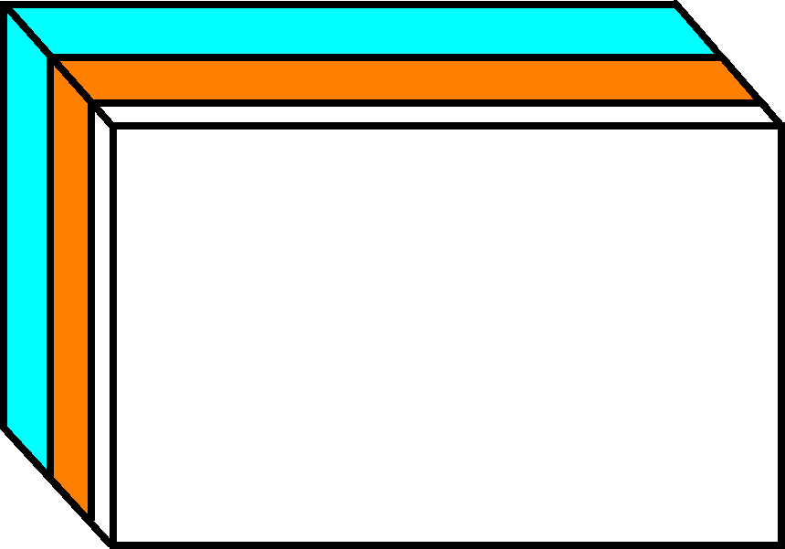
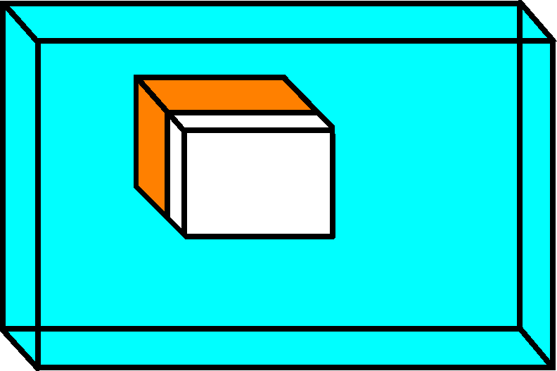

---
tags:
  - place
  - foil
  - vinyl
---

# 7. Place foil on the vinyl cutter

Place the foil on the vinyl cutter, with the white side up.

View     |Before cutting                                   |After cutting
---------|-------------------------------------------------|--------------------------------------------------------------
Slice    |        |
Isometric||

> Structure of the foil and what will be cut away.
> Light-blue: thick, transparent layer, do not cut,
> can be separated from orange layer by hand.
> Orange: the color of the print.
> White: the glue connecting the print to the T-shirt

The knife cuts the white and colored layer only.
The thick and transparent layer needs to remain intact.
