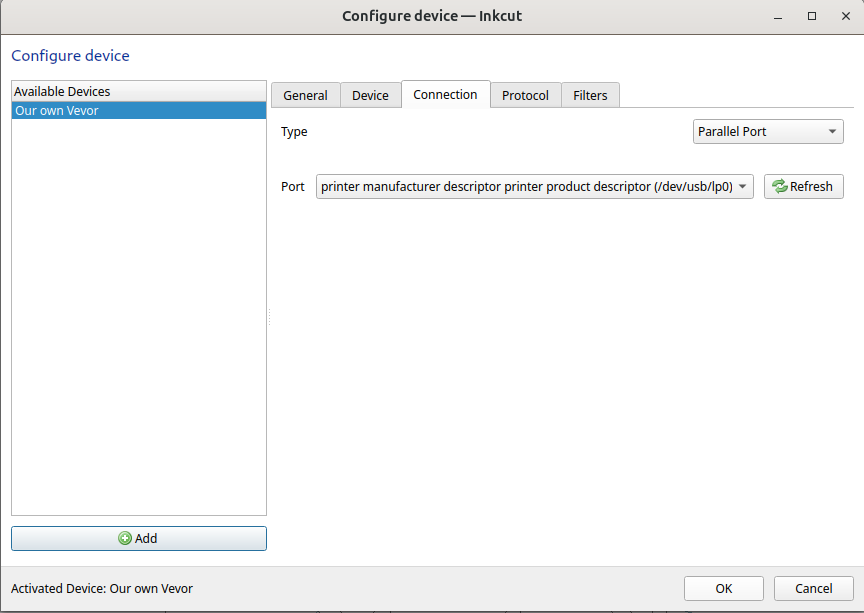
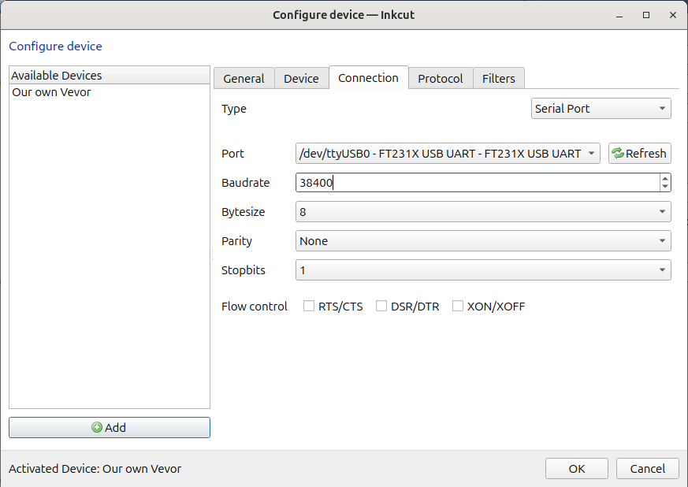

---
tags:
  - setup
  - set up
  - Inkcut
  - connection
---

# 8. Set up Inkcut connection

Depending on how you've connected the vinyl cutter,
here is how to connect Inkcut to the vinyl cutter.

## 8.1 Use the USB port

In Inkcut, go to the 'Configure device | Connection':

- Type: Parallel port
- Port: `printer manufacturer descriptor printer product descriptor (/dev/usb/lp0)`

## 8.2 Use the COM port

In Inkcut, go to the 'Configure device | Connection':

- Type: Serial port
- Port: `ttyUSB0`. If you cannot select `ttyUSB0`, you've used the wrong USB cable
  coming out of the vinyl cutter :-)
- Baudrate: 38400

???- question "Why do you use the serial port?"

    Because it was the first one that worked for me.

    Please [contribute](../CONTRIBUTING.md) if you want to
    document how to connect a laptop to the vinyl cutter
    using a parallel connection.

> Use the serial port with a baudrate of 38400.
> If you cannot select `ttyUSB0`, you've used the wrong USB cable
> coming out of the vinyl cutter

