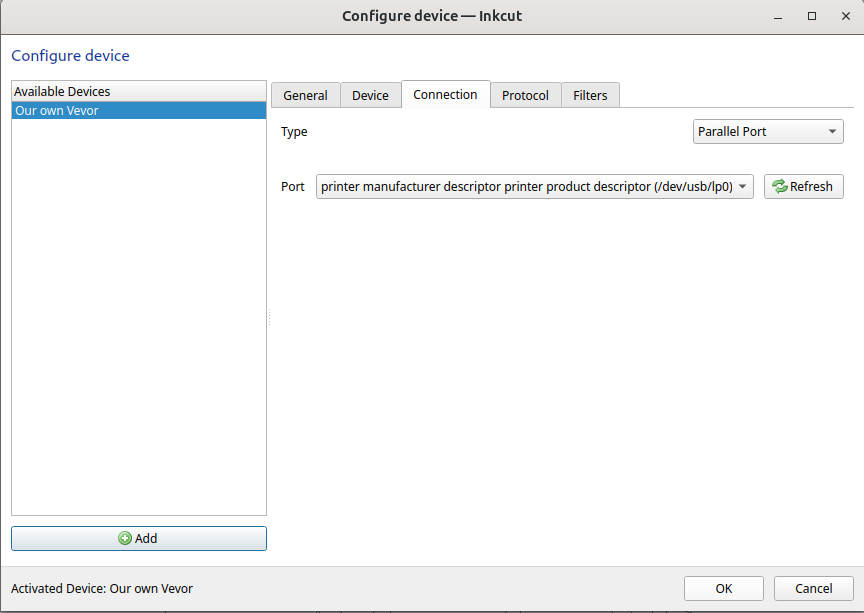
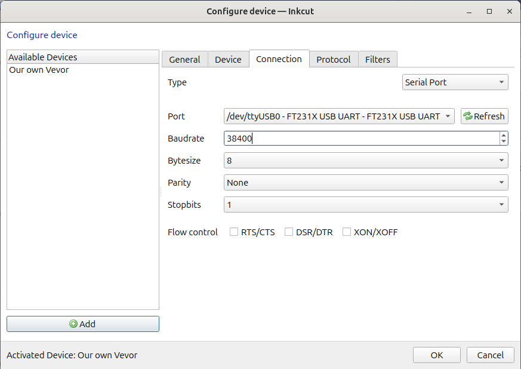

# 8. Set up Inkcut connection

In this step of
[this vinyl cutter to T-shirt manual](https://uppsala-makerspace.github.io/vevor_vinyl_cutter_to_t_shirt_manual/),
we setup an Inkcut connection, from our laptop to the vinyl cutter.

Depending on how you've connected the vinyl cutter,
here is how to connect Inkcut to the vinyl cutter.

## 8.1. Start InkCut

On a Linux computer, start a terminal:


- Press the Meta/Windows key (between Ctrl and Alt at the bottom
  left of the keyboard)


- Type `terminal`


Now you have started a terminal

In the terminal, type

```bash
~/inkcut_venv/bin/inkcut
```

Now Inkcut will start.

## 8.2. Use the USB port

If you have physically connected the vinyl cutter to your laptop using
**USB**, then, in Inkcut, go to the 'Configure device | Connection':

- Type: Parallel port
- Port: `printer manufacturer descriptor printer product descriptor (/dev/usb/lp0)`



## 8.3. Use the COM port

If you have physically connected the vinyl cutter to your laptop using
the **COM port**, then, in Inkcut, go to the 'Configure device | Connection':

- Type: Serial port
- Port: `ttyUSB0`. If you cannot select `ttyUSB0`, you've used the wrong USB cable
  coming out of the vinyl cutter :-)
- Baudrate: 38400




> Use the serial port with a baudrate of 38400.
> If you cannot select `ttyUSB0`, you've used the wrong USB cable
> coming out of the vinyl cutter
