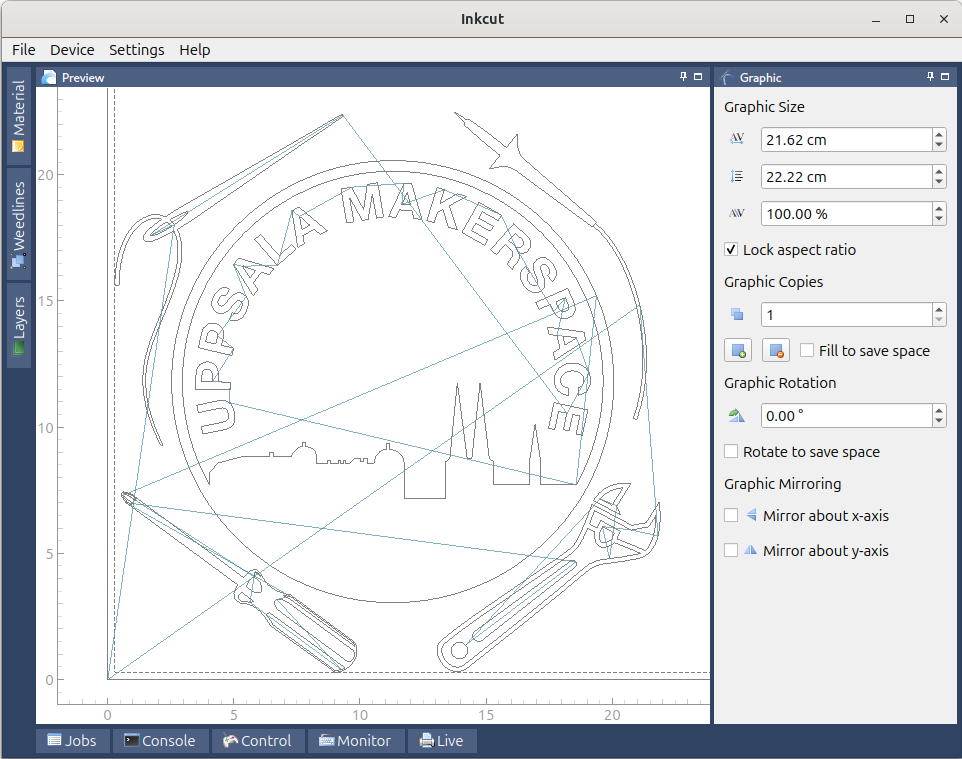
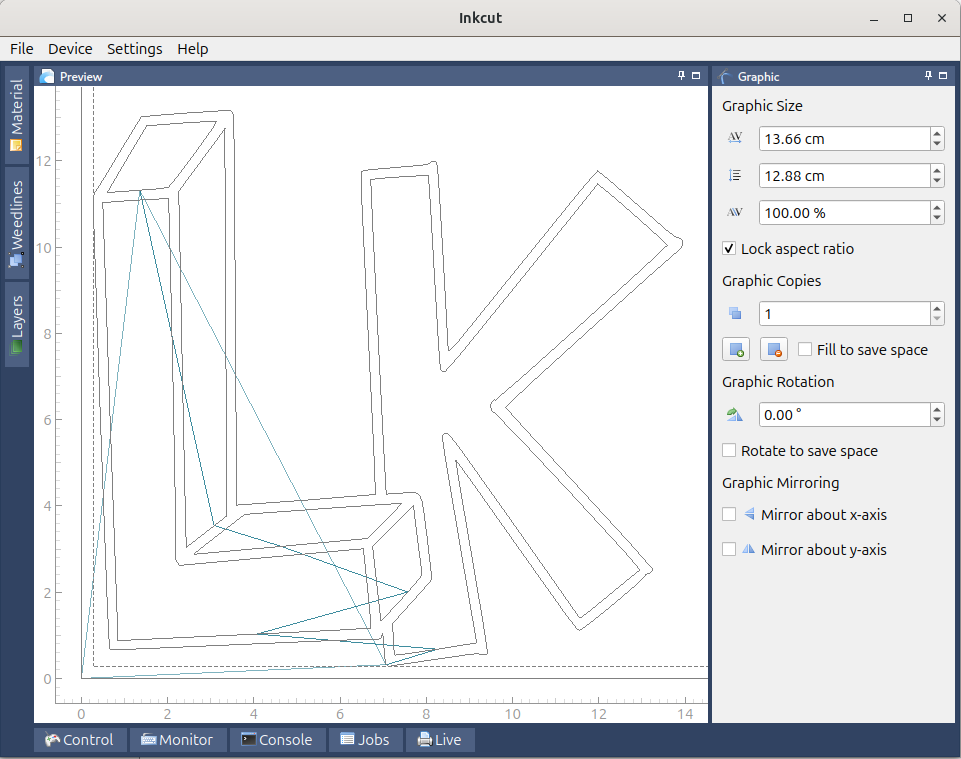
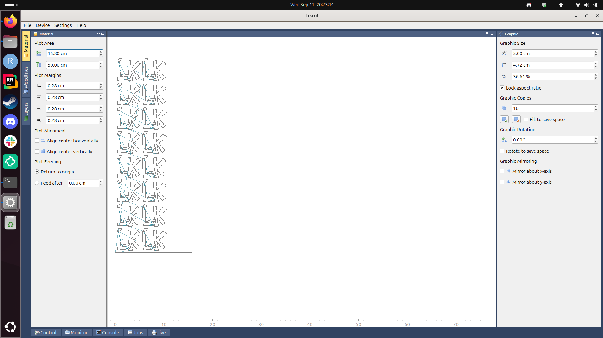
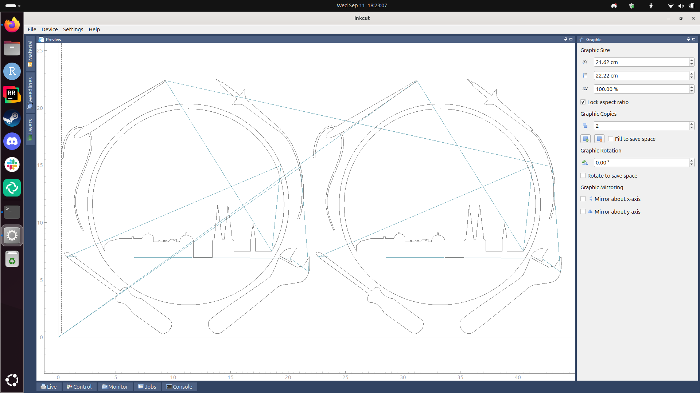
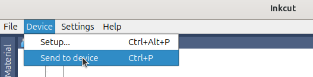

---
tags:
  - use
  - inkcut
---

# 9. Use Inkcut

In this step of
[this vinyl cutter to T-shirt manual](https://richelbilderbeek.github.io/vevor_vinyl_cutter_to_t_shirt_manual/),
we use Inkcut to make the vinyl cutter cut out a design in our vinyl foil.

## 9.1 Load an SVG

In Inkcut, load an SVG.



## 9.2 Mirror the image

Click on 'Mirror y-axis' (at the bottom-right of the screen) to mirror
the image horizontally.
This is especially important for letters.

???- question "How does forgetting this look like?"

    

    > Fig 9.2. Don't forget to mirror letters.
    > These letters will be mirrored when put on a T-shirt

## 9.3 (optional) Set up multiple images correctly

For many copies, do as shown here:



???- question "How should this not look like?"

    

    > Fig 9.3b Don't do two copies like this, this is wasteful.

## 9.4 Start the cut

Click on 'Device | Send to device' to start the vinyl cutter.



> Click on 'Device | Send to device' to start the vinyl cutter

## 9.5. Common errors

### 9.5.1. `Permssion denied: `/dev/usb/lp0`

???- question "How does the full error look like?"

    

In a terminal, type the line below and print again.

```terminal
sudo chmod +777 /dev/usb/lp0
```

This error will show up every print.
