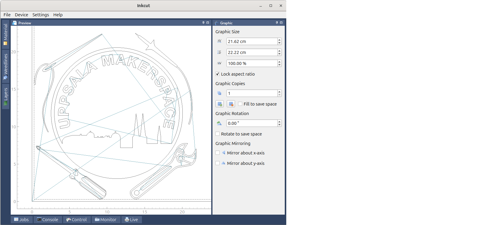

---
tags:
  - use
  - inkcut
---

# 9. Use Inkcut

Load an SVG.

> Fig 5. Inkcut in action

Don't forget to mirror letters.
These letters will be mirrored when put on a T-shirt.
Click on 'Mirror y-axis' (at the bottom-right of the screen) to mirror
the letters horizontally.

> Fig 6. Don't forget to mirror letters.
> These letters will be mirrored when put on a T-shirt

> Fig 7. Don't do two copies like this, this is wasteful.

> Fig 8. Do many copies like this: this is not wasteful

Click on 'Device | Send to device' to start the vinyl cutter:

> Click on 'Device | Send to device' to start the vinyl cutter
