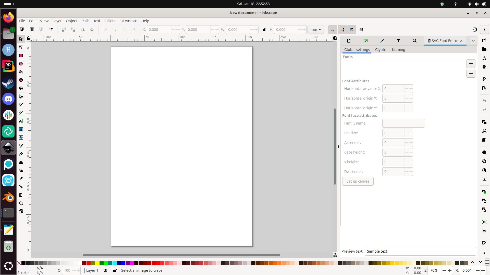

# How to create an SVG for InkCut

There are many ways images are saved to a file.
InkCut can only load SVGs.

???- question "What is an SVG?"

    A type of image that consists out of lines,
    e.g. 'A line from (0,0) to (10,20)',
    instead out of pixels.
    Due to this, you can zoom in indefinitly
    on such an image and the lines will always be sharp.

    SVG is an abbreviation of 'Scalable Vector Graphics':

    - 'Scalable': one can zoom in/out infinitely
    - 'Vector': more-or-less a line
    - 'Graphics': it is something graphical

???- question "How does that look like?"

    Here we InkCut displaying on the SVGs in folder:

    

One cannot simply upload a 'regular' image (such as PNG or JPG)
to InkCut: these must be converted to an SVG first.

???- question "What is an PNG?"

    A type of image that consists out of pixel values,
    e.g. '10 red pixels, then 5 white' pixels.
    Due to this, when you zoom in on such an image,
    you can see the pixels being square.

???- question "What is a JPG?"

    A type of image that consists out of wavelengths;
    this is hard to describe simply.
    When you zoom in on such an image,
    you can see the pixels being square.

## Converting a 'regular' image (such as PNG or JPG) to SVG

One program that can do this is Inkscape.

This is how Inkscape looks like:

To import a 'regular' image (such as PNG or JPG),
click 'File | Import'

???- question "Where is that?"

    You can find it here:

    

Select a file to import.

???- question "How does that look like?"

    Here is an example:

    

In the import settings, click OK

???- question "How does that look like?"

    This is how that look likes:

    

You have now imported the 'regular' image
in Inkscape.

???- question "How does that look like?"

    This is how that look likes:

    

Now you can save the image as an SVG. Do so, by clicking 'File | Save as'.

???- question "Where is that?"

    You can find it here:

    

Give your SVG a name and save it.

???- question "How does that look like?"

    This is how that look likes:

    

What you don't know yet: this SVG cannot be loaded in InkCut.

???- question "How does that look like in InkCut?"

    Here is how this would look like in InkCut:

    

    As you can see: only white

## Fixing an SVG

In Inkscape, click 'Path | Trace Bitmap'.

???- question "Where is that?"

    You can find it here:

    

Click on 'Apply'.

???- question "Where is that?"

    You can find it here:

    

The image *looks* the same, but is not.

???- question "How does it look like?"

    It looks like this:

    

However, you can save the image as SVG
and load it into InkCut successfully!

???- question "How does it look like in InkCut?"

    It looks like this:

    

## Videos

- [YouTube video 'How to convert a PNG to SVG'](https://www.youtube.com/watch?v=peJcuRImCmY)
