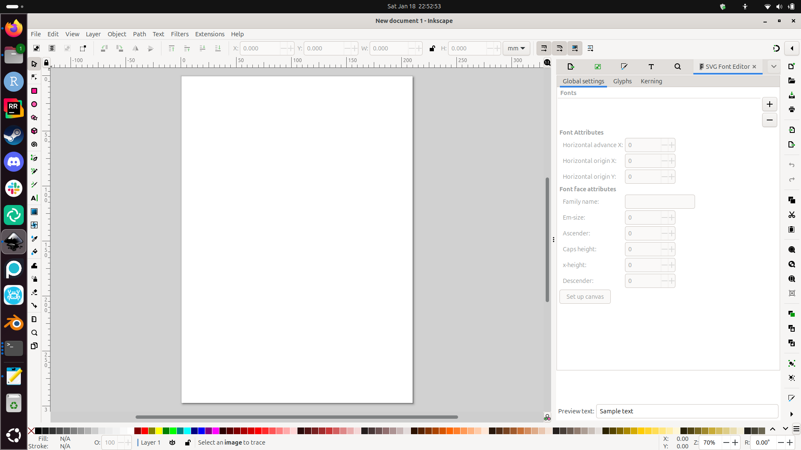

# How to create an SVG for Inkcut

In this part of
[the vinyl cutter to T-shirt manual](https://uppsala-makerspace.github.io/vevor_vinyl_cutter_to_t_shirt_manual/),
we give some guidelines on how to create an SVG for Inkcut.

There are many ways images are saved to a file.
Inkcut can only load SVGs.

One cannot simply upload a 'regular' image (such as PNG or JPG)
to Inkcut: these must be converted to an SVG first.

## Converting a 'regular' image (such as PNG or JPG) to SVG

One program that can do this is Inkscape.

This is how Inkscape looks like:

To import a 'regular' image (such as PNG or JPG),
click 'File | Import'

Select a file to import.

In the import settings, click OK

You have now imported the 'regular' image
in Inkscape.

Now you can save the image as an SVG. Do so, by clicking 'File | Save as'.

Give your SVG a name and save it.

What you don't know yet: this SVG cannot be loaded in Inkcut.

## Fixing an SVG

In Inkscape, click 'Path | Trace Bitmap'.

Click on 'Apply'.

The image *looks* the same, but is not.

However, you can save the image as SVG
and load it into Inkcut successfully!

## Videos

- [YouTube video 'How to convert a PNG to SVG'](https://www.youtube.com/watch?v=peJcuRImCmY)
