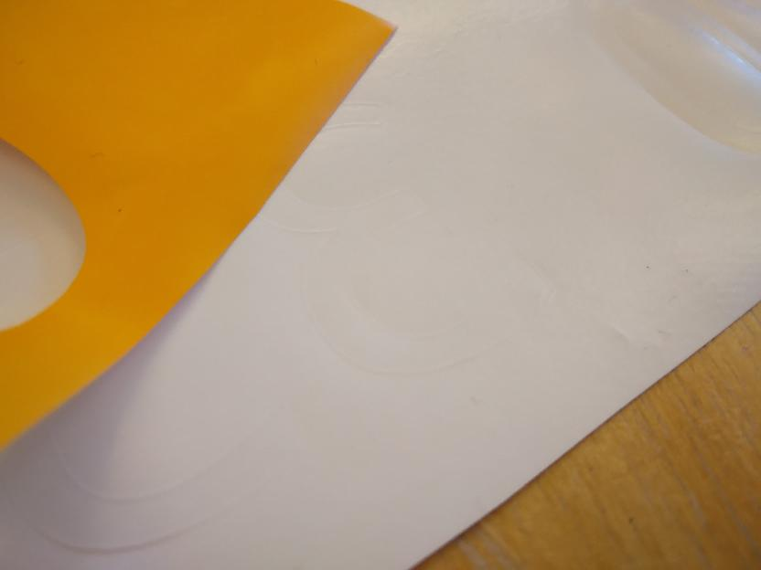

---
tags:
  - procedure
  - overview
---

# Procedure

For this procedure, these are the machines and materials needed:

Machine/material |Picture
-----------------|--------------------------------------------------------------------
Laptop with Linux|Imagine a laptop with Linux installed
Vinyl cutter     |
Heat press       |
T-shirt          |Imagine a T-shirt here
Vinyl            |

Below is an overview of the procedure
and the dependencies between the steps.

