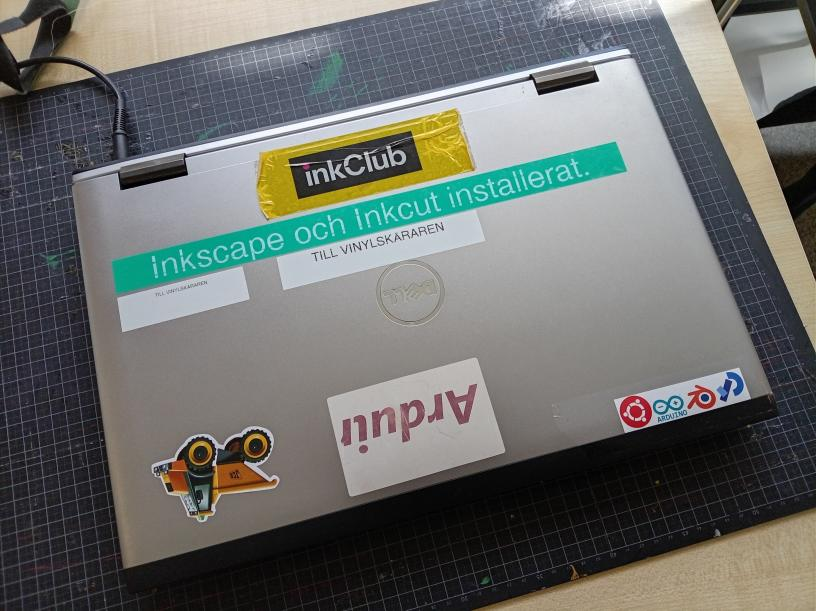
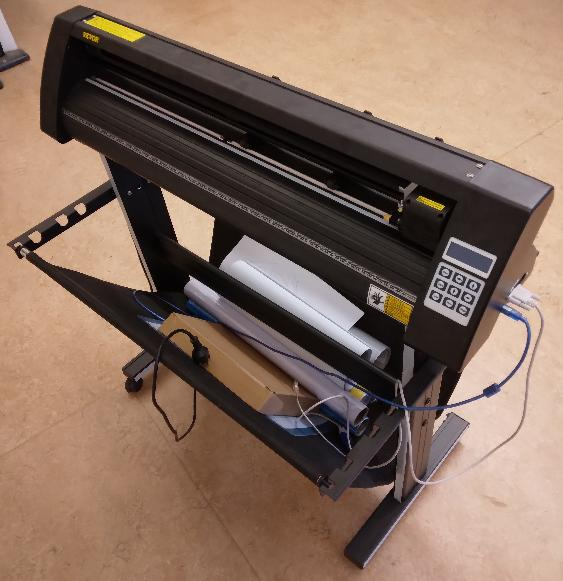
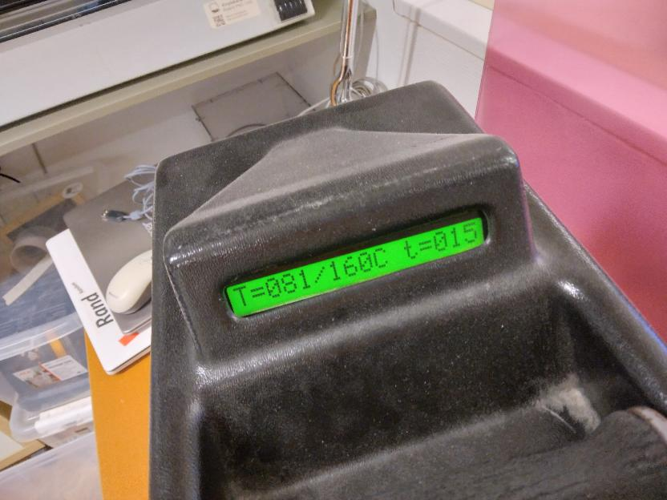
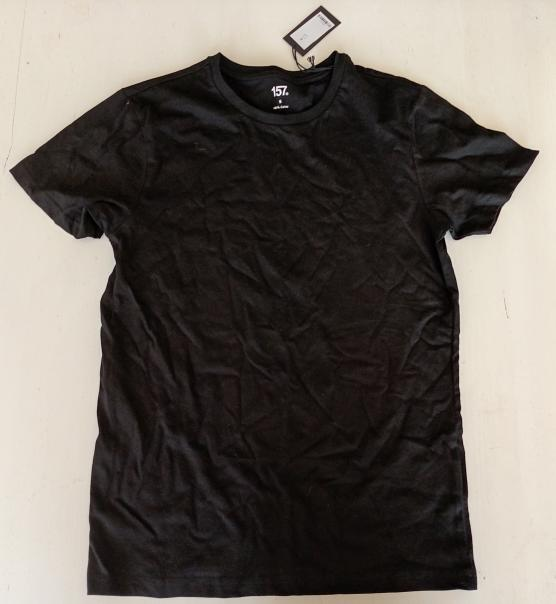
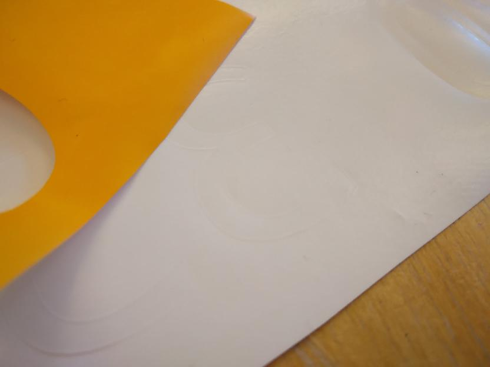
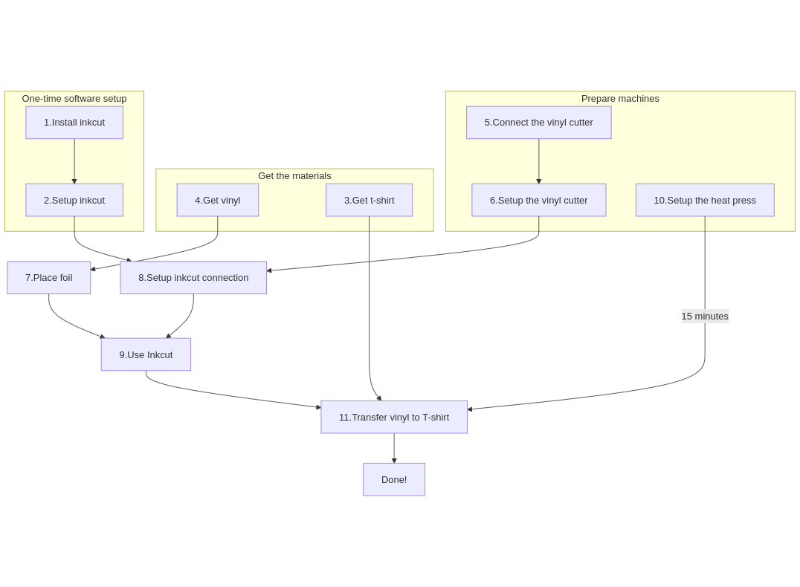

---
tags:
  - procedure
  - overview
---

# Procedure

In this page of
[the vinyl cutter to T-shirt manual](https://richelbilderbeek.github.io/vevor_vinyl_cutter_to_t_shirt_manual/),
we give an overvire of all machines needed, as well as the procedure.

For this procedure, these are the machines and materials needed:

Machine/material |Picture
-----------------|--------------------------------------------------------------------
Laptop with Linux|
Vinyl cutter     |
Heat press       |
T-shirt          |
Vinyl            |

These are the steps:

Step|Description
----|----------------------------------------------------------------
0   |[Check Inkcut is installed](0_check.md)
1   |[Install Inkcut](1_install_inkcut/README.md)
2   |[Setup Inkcut](2_setup_inkcut.md)
3   |[Get T-shirts](3_get_t_shirts.md)
4   |[Get vinyl](4_get_vinyl.md)
5   |[Connect vinyl cuter](5_connect_vinyl_cutter.md)
6   |[Setup vinyl cutter](6_setup_vinyl_cutter.md)
7   |[Place foil](7_place_foil.md)
8   |[Setup Inkcut connection](8_setup_inkcut_connection.md)
9   |[Use Inkcut](9_use_inkcut.md)
10  |[Setup heat press](10_setup_heat_press.md)
11  |[Peel foil](11_peel_vinyl.md)
12  |[Transfer vinyl to T-shirt](12_transfer_vinyl_to_t_shirt.md)

Below is an overview of the procedure
and the dependencies between the steps.

