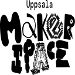

---
tags:
  - example
  - SVGs
  - images
---

# SVGs

These are example SVGs.

<!-- Some unavoidable long lines -->
<!-- markdownlint-disable MD013 -->

Filename                                                  |Thumbnail                                                                      |Description
----------------------------------------------------------|-------------------------------------------------------------------------------|---------------------------
[2024_logo_Complex_Black.svg](2024_logo_Complex_Black.svg)||2024 UMS logo, complex
[2024_logo_Simple_Black.svg](2024_logo_Simple_Black.svg)  |  |2024 UMS logo, simple
[2024_logo_Lazy_Black.svg](2024_logo_Lazy_Black.svg)      |      |2024 UMS logo, lazy
[oscu_logo.svg](oscu_logo.svg)                            |.                                                                              |Open Science Community Uppsala logo
[UMS_logo_18.svg](UMS_logo_18.svg)                        |                        |2014 UMS logo, complex
[UMS_logo_18_no_letters.svg](UMS_logo_18_no_letters.svg)  |  |2014 UMS logo, simple
[UMS_logo_18_lite.svg](UMS_logo_18_lite.svg)              |        |2014 UMS logo, lazy
[R_written.svg](R_written.svg)                            |                            |A handwritten character `R`
[timeseries_horizontal.svg](timeseries_horizontal.svg)    |    |A timeseries
[timeseries_vertical.svg](timeseries_vertical.svg)        |        |A timeseries
[utusho.svg](utusho.svg)                                  |                                  |Logo inspired by [Utsuho Reiuji](https://en.touhouwiki.net/wiki/Utsuho_Reiuji)

<!-- markdownlint-enable MD013 -->
