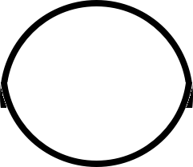
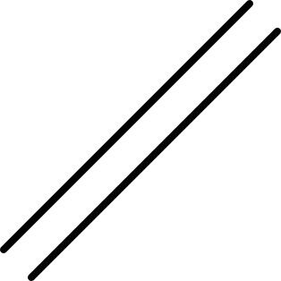
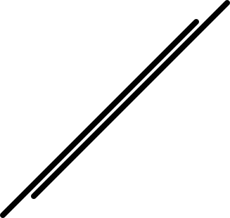
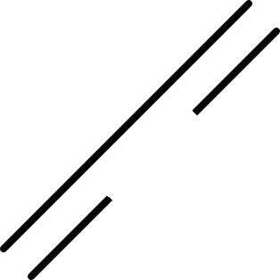

---
tags:
  - troubleshooting
  - problems
---

# Troubleshooting

## The vinyl cutter is wrinkling the paper

> The vinyl cutter is wrinkling the paper.

This happens when at least one wheel of the three movable heads is
not on a roller at the bottom:

> The right wheel (right rectangle) is not on the roller
> (partially shown and indicated by the left rectangle)

## The vinyl cutter is confused

This may happen when you send multiple prints at the same time.
Press reset, close Inkcut, press reset, start Inkcut and try again

## The cut does not follow the image

<!-- markdownlint-disable MD013 --><!-- Tables cannot be split up over lines, hence will break 80 characters per line -->

Example|Correct                              |Incorrect
-------|-------------------------------------|-----------------------------------------
Circle ||
Lines  |  |

<!-- markdownlint-enable MD013 -->

This happens when you have three roller wheels connected to the vinyl,
instead of just two.

Disconnect the middle weel from the vinyl.

## The cut does not cut

<!-- markdownlint-disable MD013 --><!-- Tables cannot be split up over lines, hence will break 80 characters per line -->

Example|Correct                              |Incorrect
-------|-------------------------------------|-----------------------------------------
Circle ||
Lines  |  |

<!-- markdownlint-enable MD013 -->

This happens when the force of the knife is too low..
In [step 6: setup the vinyl cutter](../steps/6_setup_vinyl_cutter.md),
increase the force.
