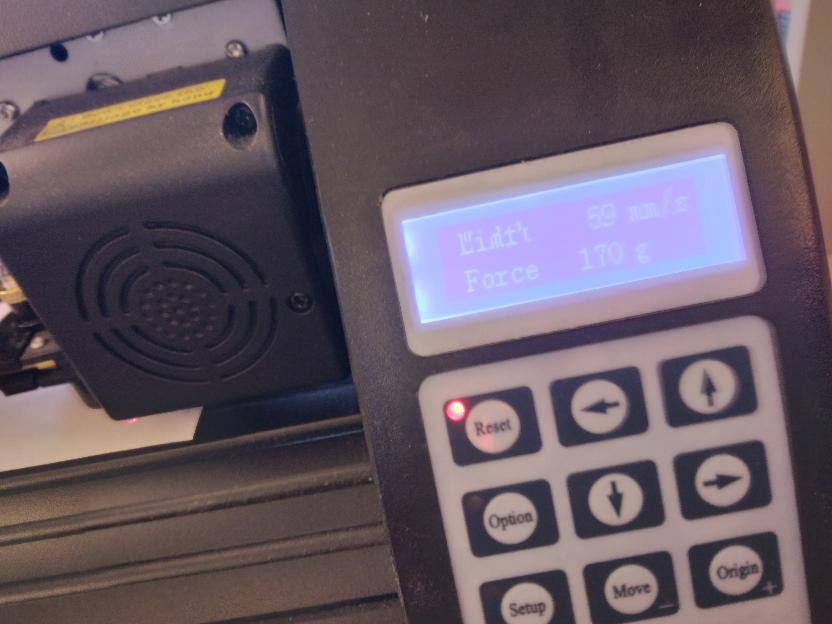

---
tags:
  - troubleshooting
  - problems
---

# Troubleshooting

## The vinyl cutter is wrinkling the paper

> The vinyl cutter is wrinkling the paper.

This happens when at least one wheel of the three movable heads is
not on a roller at the bottom:

> The right wheel (right rectangle) is not on the roller
> (partially shown and indicated by the left rectangle)

## The vinyl cutter is confused

This may happen when you send multiple prints at the same time.
Press reset, close Inkcut, press reset, start Inkcut and try again
