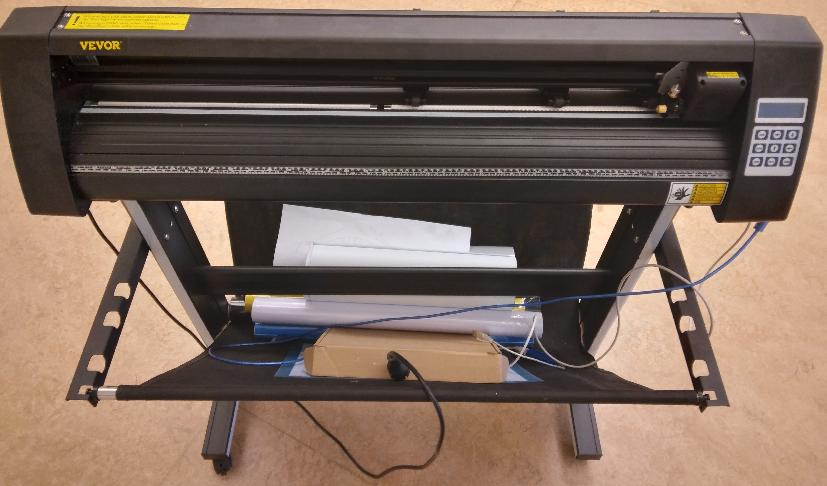
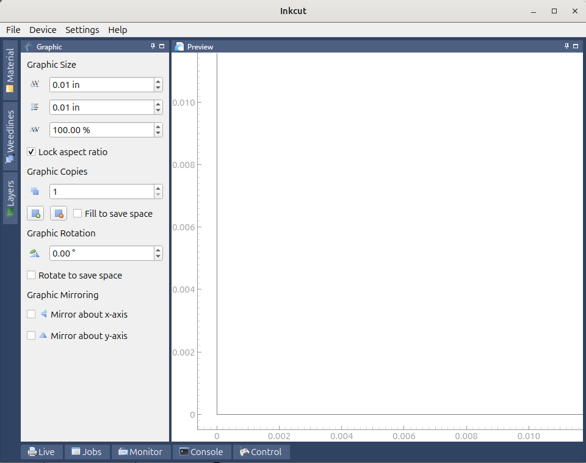
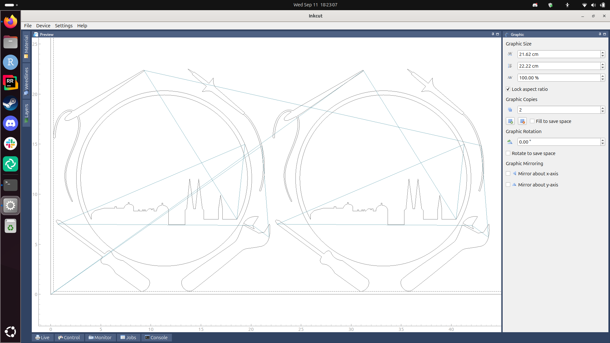
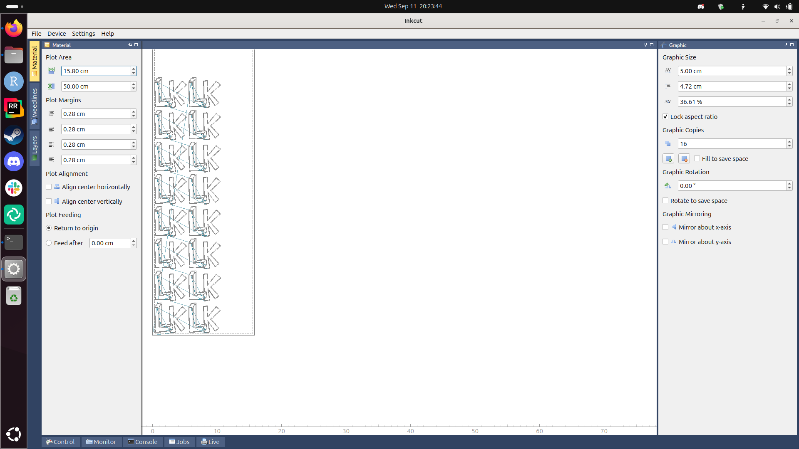

# Vinyl cutter to T-shirt manual

Our Vevor vinyl cutter from the front|Our Vevor vinyl cutter from an isometric perspective
-------------------------------------|-------------------------------------
    |

Manual for using the Vevor vinyl cutter to create a T-shirt

## Time estimates

- Most time will be spent peeling plastic from the vinyl
- Schedule two hours to produce your first T-shirt with one print
- Schedule 10 minutes to produce your tenth T-shirt with one print,
  15 minutes for two print

## Procedure

1. Install Inkcut
1. Setup Inkcut
1. Connect the vinyl cutter
1. Find suitable foil
1. Place foil of vinyl cutter
1. Set up Inkcut connection
1. Use Inkcut
1. Transfer vinyl to T-shirt

## 1. Install Inkcut

- See [Install Inkcut notes](install_inkcut_notes.md) for the notes behind this

Install the Debian packages:

```bash
apt-get install python3-pip python3-pyqt5 python3-setuptools libcups2-dev python3-pyqt5.qtsvg
```

Create a (mandatory!) virtual environment for Inkcut:

```bash
python3 -m venv ~/inkcut_venv
```

Install the Inkcut and PyQt5 Python packages in the virtual environment"

```bash
~/inkcut_venv/bin/pip install inkcut PyQt5
```

Now you can start `inkcut` with:

```bash
~/inkcut_venv/bin/inkcut 
```



## 2. Setup Inkcut

- See [Setup Inkcut notes](setup_inkcut_notes.md) for the notes behind this

Add yourself to the `dialout` group:

```bash
sudo usermod -a -G dialout "$USER"
```

Restart (yes, a cold boot!).

## 3. Connect the vinyl cutter

Plug in the correct USB cable from the vinyl cutter to your computer:

Vinyl cutter side|Center|Computer side
---|---|---
||

## 4. Find suitable foil

Suitable foil looks like this:


- The foil feels smoother than a sticker
- The foil is shinier than a sticker

## 5. Place foil of vinyl cutter

Place the foil on the vinyl cutter, with the white side up.

View     |Before cutting                                   |After cutting
---------|-------------------------------------------------|--------------------------------------------------------------
Slice    |        |
Isometric||

> Structure of the foil and what will be cut away.
> Light-blue: thick, transparent layer, do not cut,
> can be separated from orange layer by hand.
> Orange: the color of the print.
> White: the glue connecting the print to the T-shirt

The knife cuts the white and colored layer only.
The thick and transparent layer needs to remain intact.

## 6. Set up Inkcut connection

Go to the 'Configure device | Connection':

- Type: Serial port
- Port: `ttyUSB0`. If you cannot select `ttyUSB0`, you've used the wrong USB cable
  coming out of the vinyl cutter :-)
- Baudrate: 38400


> Use the serial port with a baudrate of 38400.
> If you cannot select `ttyUSB0`, you've used the wrong USB cable
> coming out of the vinyl cutter

## 7. Use Inkcut

Load an SVG.


> Inkcut in action


> Don't forget to mirror letters!
> The letters should be mirrored horizontally



> Don't do two copies like this, this is wasteful.



> Do many copies like this: this is not wasteful

## 8. Transfer vinyl to T-shirt

Put the remainder of the foil on the T-shirt,
with the colorful side up.


> Press not yet ready. It shoud say `T=160/160C`. A temperature from
> 155 to 165 degrees Celcius would also be fine.

Heat up the heat press, this takes about 15 minutes.

Place the T-shirt under the press,
with the foil at the right spot.

When the heat press is warmed up,
lower the press. After around 20 seconds,
the press will start to beep. Raise the press again.

Wait for the print to cool off.

Carefully peel off the transparent layer from the shirt.

Done!


## Troubleshooting

### The vinyl cutter is confused


This may happen when you send multiple prints at the same time.
Press reset, close Inkcut, press reset, start Inkcut and try again


